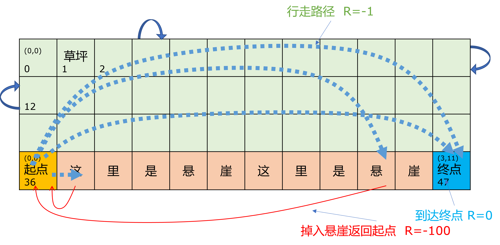

## 10.1 悬崖漫步问题

本章中我们要解决的问题是 Gym 内的 Toy Text 环境中的另外一个问题：Cliff Walking，悬崖漫步问题。见图 10.1.1。



图 10.1.1 悬崖漫步问题

环境说明如下。

- 目标：从起点出发安全走到终点。

- 状态：本质上是一个方格世界（Grid World），一共有 48 个格子，但是只有 37 个有效状态，即黄色和绿色的格子。左上角坐标是[0, 0]，右下角坐标是[3, 11]。起点在左下角 [3,0] ，终点在右下角 [3, 11]。

- 动作：有 4 个动作，但是编号顺序和冰面滑行问题不同，这里是 上、右、下、左，对应动作序号 0、1、2、3。

- 奖励：每次移动 $R=-1$（包括出界和到达终点），掉入悬崖$R=-100$。

- 分幕：智能体每次移动一步，如果出界则返回原地，如果掉入悬崖（进入红色格子）则返回起点。到达终点算一幕。

**问题：如何让智能体从起点出发，安全走到终点？**

### 10.1.1 得到基准解

本问题其实也是有模型的，但是我们要“假装”把它当作无模型的问题来处理，以便解释算法。当然，像前面一样，我们可以先用 DP 方法得到基准，然后比较本章中的各种方法的效果和效率。

运行【代码：CliffWalking_1_DP.py】，得到随即策略下的状态价值函数 $v_\pi$ 的值如下：


```
DP 策略评估 V 的迭代次数 =  104
---------------DP---------------
[[ -53.3  -56.5  -59.3  -61.   -61.9  -62.3  -62.3  -61.9  -61.   -59.3   -56.5  53.3]
 [ -69.3  -77.5  -82.3  -84.5  -85.5  -85.9  -85.9  -85.5  -84.5  -82.3   -77.5  69.3]
 [-103.5 -131.9 -140.  -142.5 -143.3 -143.6 -143.6 -143.3 -142.5 -140.  -131.9 -103.]
 [-150.9 -182.  -208.6 -209.2 -209.4 -209.4 -209.4 -209.4 -209.2 -208.6  -182.  150.9]]
```

注意，DP 方法不管状态的区别，一视同仁地把所有 48 个格子都计算出来了，但实际上，如果用 MC 方法以及本章中要介绍的时序差分系列算法，对于格子序号 37~46 的悬崖区域，实际上是达到不了的，所以其状态价值应该是 0。终点也是如此。所以我们用代码 ```V_dp[37:48] = 0``` 把这些格子的值设置为 0。

另外，由于状态值的绝对值比较大，所以我们忽略小数点后面的部分。最终得到以下值：

```
---------------DP---------------
[[ -53.  -56.  -59.  -61.  -62.  -62.  -62.  -62.  -61.  -59.  -56.  -53.]
 [ -69.  -77.  -82.  -85.  -86.  -86.  -86.  -86.  -85.  -82.  -77.  -69.]
 [-104. -132. -140. -142. -143. -144. -144. -143. -142. -140. -132. -104.]
 [-151.    0.    0.    0.    0.    0.    0.    0.    0.    0.    0.    0.]]
```

### 10.1.2 误差计算方法

在第 9 章中，我们使用 RMSE 方法来计算误差。它有个缺点：当原始值比较大的时候，误差的值也会比较大；原始值比较下的时候，误差的值也会变小。这样就无法区分误差的相对大小了。

比如，假设真实值为 $y=[1,2,3]$，观测值为 $x=[1.1,2,2.9]$，则：
$$
\mathrm{RMSE}=\sqrt{[(1.1-1)^2+(2-2)^2+(2.9-3)^2]/3} \approx 0.08
$$

如果原始值都缩小10倍，则误差也缩小10倍：

$$
\mathrm{RMSE}=\sqrt{[(0.11-0.1)^2+(0.2-0.2)^2+(0.29-0.3)^2]/3} \approx 0.008
$$

所以看不出来误差到底是不是真的小了，而只能用于比较两个算法之间的误差。所以我们稍微改一下误差算法，用二范数来计算：

$$
L_2=||X||_2=\sqrt{\sum_{i=1}^nx_i^2}, \ X=(x_1,x_2,...,x_n)
$$

用误差值的二范数除以基本值的二范数：

$$
\mathrm{NormError} = \frac{||X-Y||_2}{||Y||_2}
$$

代码实现如下，见【代码：common/CommonHelper.py】：

```python
def Norm2Err(x, ground_truth):
    a = np.linalg.norm(x - ground_truth, 2)
    b = np.linalg.norm(ground_truth, 2)
    return a/b
```

而用 Norm2Err() 方法可以得到以下结果：

```python
x = np.array([1,2,3])
y = np.array([1.1,2,2.9])
print("原始误差:", Norm2Err(x, y))
print("缩放误差:", Norm2Err(x/10, y/10))
```
得到误差：
```
原始误差: 0.038320083261967404
缩放误差: 0.038320083261967404
```

虽然原始值缩小了 10 倍，但是误差值一样，并且这个方法的计算结果是相对误差，介于 0 到 $+\infty$ 之间，可以相互比较，值越小，误差越小。
