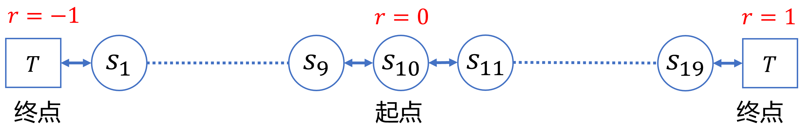

## 11.1 多步时序差分预测

图 11.1.1 两步时序差分的第一次更新

### 11.1.1 算法描述

### 11.1.2 代码实现

### 11.1.3 比较 TD(0) 和 TD-$n$

图 11.1.2 随机游走问题

图 11.1.3 $n=5、\alpha=0.1$时的情况

### 11.1.4 $\alpha$ 与 $n$ 值的最佳组合搜索

图 11.1.4 不同的$n$与$\alpha$的参数组合的误差
