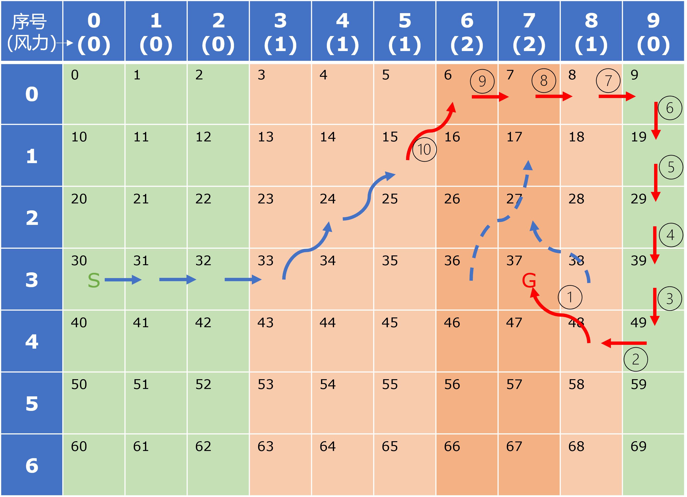

## 11.2 多步 Sarsa 同策略控制

图 11.2.1 两步 Sarsa 的第一次更新

### 11.2.1 算法描述

### 11.2.2 代码实现

### 11.2.3 比较单步和多步 Sarsa 的学习能力

图 11.2.2 有风的方格世界

图 11.2.3 Sarsa-n 的学习效果比较

### 11.2.4 比较不同 $n$ 值下的收益

图 11.2.3 不同 $n$ 值的每幕收益比较

