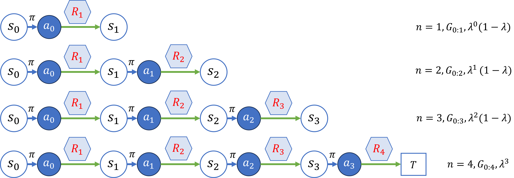
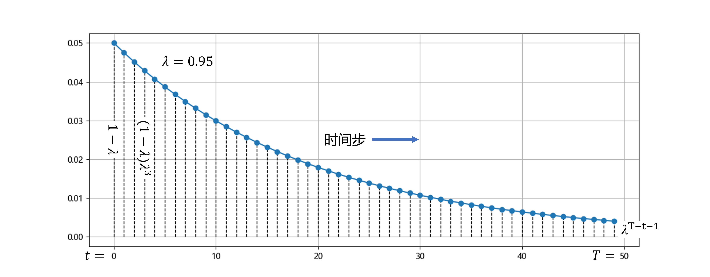
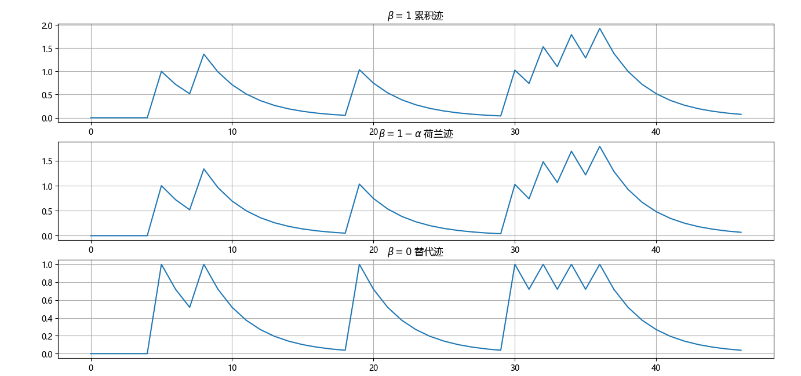
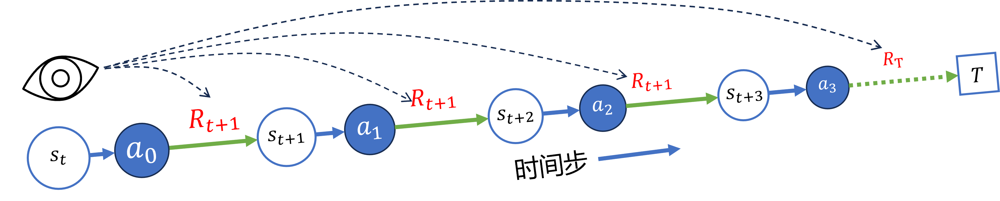
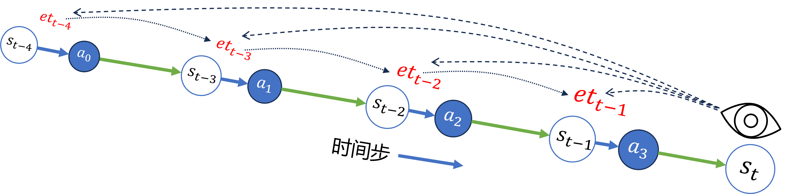

## 11.4 资格迹

### 11.4.1 $\lambda$-回报

图 11.4.1 $\lambda$-回报示意图

图 11.4.1 $\lambda$-回报的权重以速率 $\lambda$ 衰减

### 11.4.2 TD$(\lambda)$

图 11.4.2 各种资格迹值的变化

### 11.4.3 Sarsa$(\lambda)$

### 11.4.4 其它几种资格迹方法

图 11.4.3 前向视图

图 11.4.4 后向视图
