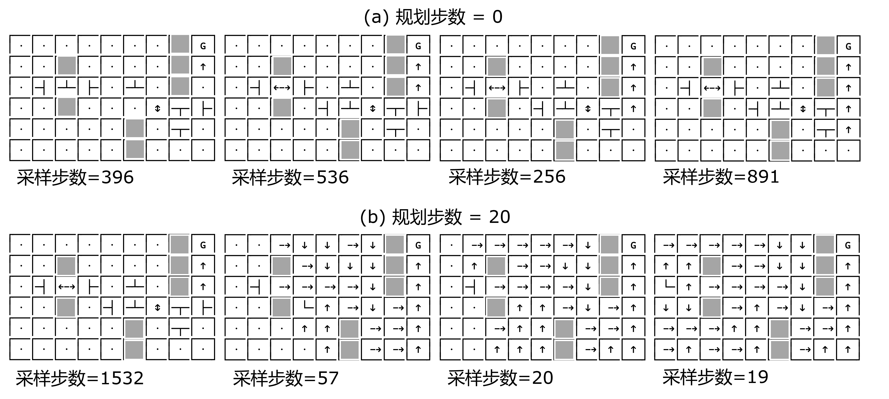

## 11.5 Dyna-Q 算法

图 11.5.1 Dyan-Q 架构

### 11.5.1 算法描述

### 11.5.2 代码实现

### 11.5.3 比较不同规划次数的学习效果

图 11.5.2 迷宫问题

图 11.5.2 比较三种规划步数下的收敛速度

图 11.5.3 放大后的比较图

### 11.5.4 比较有无规划的学习过程

图 11.5.4 有无规划的学习效果比较

