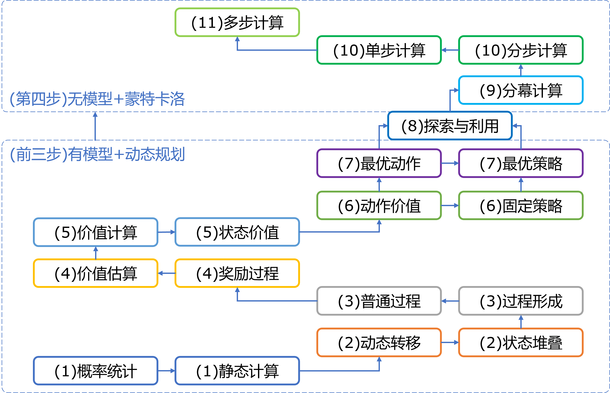
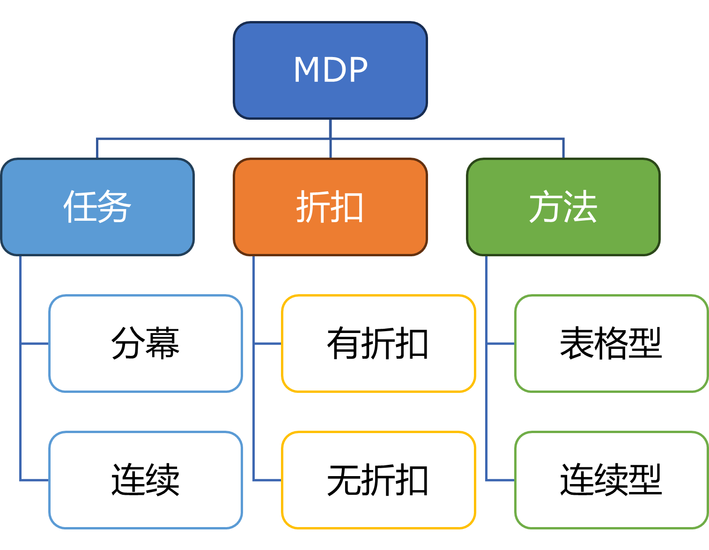
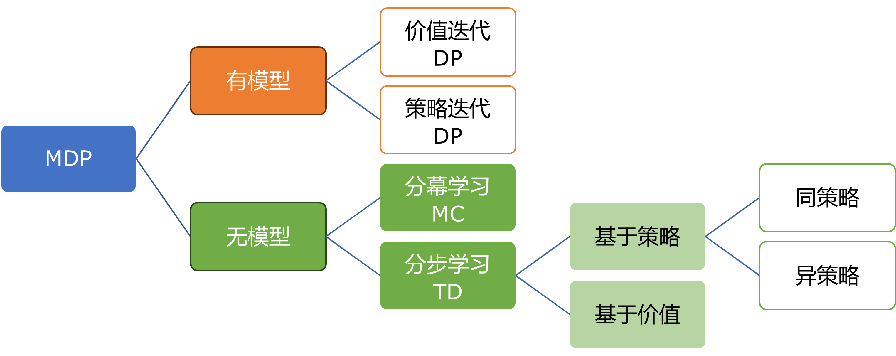

## 12.1 学习路径总结

在图 12.1.1 中，对前 11 章的内容进行了一个总结。其中，括号内的数字代表第几章或者第几步。

图 12.1.1 前11章的学习路径总结

前三步都是讲有模型问题和动态规划算法，由此引出了环境、动作、策略、奖励等强化学习的重要概念。到了第四步，转为无模型和蒙特卡洛方法，但是同样要面对上述重要概念。而更多的无模型和更强的策略优化算法将会在本书的后续《智能之门：深度强化学习》中讲解。

我们将在下面做两个分类，通过不同角度的比较来深化这些概念。请读者注意，这里的分类还只是在本书的知识基础上建立的，还有一些其它的分类没有体现在本书中，将会在《智能之门：深度强化学习》中讲解。

### 12.1.1 按 MDP 中的属性分类

图 12.1.2 是按 MDP 中的属性分类。

图 12.1.2 按属性分类

#### 1. 分幕任务与连续任务

目前在前十一章的例子中，遇到的连续任务（sequential task）有“租车还车问题”和“穿越虫洞问题”，因为它们没有结束状态。而在其它问题中，都是有分幕的，既，有结束状态。其中，“躲避强盗问题”比较特殊，没有状态，由于需要多次交互，所以可以看作是连续任务。

在现实生活中，分幕任务（episodic task）比较多，比如 AlphaGo 和其它棋牌类游戏。对话类或生成类任务中，强调交互轮数越多越好，所以算作没有分幕的连续任务。

#### 2. 有折扣与无折扣

在计算回报 $G$ 时，无折扣的计算方法是：$G_t=R_{t+1}+R_{t+2}+ \cdots + R_T$，而有折扣的计算方法是：$G_t=R_{t+1}+\gamma R_{t+2}+ \cdots + \gamma^{T-t+1} R_T$。

一般来说，我们都会选择有折扣的方法，这样可以在一定程度上保证收敛。也意味着我们更看重当前的奖励，而把远期的奖励大打折扣。无折扣的方法一般用于试验，或者是分步奖励为 0 时，强调把达到终止状态的奖励完整地回传到轨迹中的每一步上。

#### 3. 表格型与连续型

这里又包含两种情况：时间是否连续，动作是否连续。按时间是否连续分类时，可以分为离散时间环境（discrete time envrionment）和连续时间环境（continuous time environment），可以对应到状态空间上。按动作是否连续分类时，可以分为离散动作空间（discrete action space）和连续动作空间（continuous action space）.

目前我们遇到的都是表格型问题，即使是像“冰面滑行”这种在时间和动作上都连续的任务也被分割成了方格世界来处理，具有离散的状态。这也是本书的重点学习方法。在后续的《智能之门：深度强化学习》中，将会学习连续型的问题，比如一辆车在行进中的状态就是连续的，不能用表格来表示，而只能用函数来表示。

### 12.1.2 按模型分类

图 12.1.3 是按 MDP 中是否有模型来分类。

图 12.1.3 按是否有模型分类

#### 1. 有模型与无模型

在前十一章中的例子都是有模型的例子，只不过有时候我们会把它们当作无模型来处理，以便讲解算法与基准值比对。而在现实世界中，无模型或者模型非常复杂的例子很多，在后续的《智能之门：深度强化学习》一书中将会涉及到大量的例子。

有模型时，我们用 DP 方法就可以轻松解决，前提是状态数量不要太多。主要方法是价值评估、策略评估、价值迭代、策略迭代。无模型时，只能靠采样，用 MC 分幕学习或 TD 分步学习方法来解决，它们都是基于价值的学习方法，价值包括状态价值和动作价值，但主要是后者。基于价值的学习方法又会分为同策略和异策略，如下所述。

#### 2. 价值迭代与策略迭代

价值迭代通过对状态价值函数和动作价值函数取最大值的迭代来实现找到最有动作价值函数的目的，进而得到最优策略。策略迭代通过策略评估和策略改进来得到最优策略。这两种方法都牵涉到策略，因此叫做控制问题，与单纯的价值函数预测问题形成对比。

#### 3. 分幕学习与分步学习

MC 是标准的分幕学习，当一幕采样结束（到达终止状态）时才开始更新价值函数，是无偏的，但是方差大。TD 是分步学习方法，在采样的每一步或者每 $n$ 步以自举的方式更新价值函数，是有偏的，但是方差小。因此，又涌现出来一些算法融合了 MC 和 TD，来降低前者的方差和后者的偏差。

#### 4. 基于策略与基于价值

基于策略（policy-based）和基于价值（value-based）是两种主要的方法论框架，它们在学习和决策过程中关注不同的方面：

基于策略的方法：这种方法直接学习一个策略函数，该函数映射状态到动作的概率分布。换句话说，它学习在给定状态下采取每个可能动作的概率。策略可以表示为 $\pi(a|s)$，其中 $a$ 是动作，$s$ 是状态，$\pi(a|s)$ 是在状态 $s$ 下采取动作 $a$ 的概率。基于策略的方法通常使用策略梯度（policy gradient）来优化策略，使得预期回报最大化。

基于价值的方法：这种方法学习状态的价值函数或者状态-动作对的价值函数，而不是直接学习策略。价值函数估计从某个状态或状态-动作对开始，采取最优策略所能获得的预期回报。状态价值函数可以表示为 $v(s)$，它估计从状态 $s$ 开始，遵循最优策略所能获得的预期回报。状态-动作价值函数（也称为动作价值函数）可以表示为 $q(s, a)$，它估计在状态 $s$ 下采取动作 $a$ 并遵循最优策略所能获得的预期回报。基于价值的方法通常使用价值迭代或价值学习算法，如Q学习或Sarsa算法。这些方法通过迭代更新价值函数来逼近最优价值函数，从而间接地学习策略。

两种方法的比较如下。

- 基于策略的方法直接学习行为策略，而基于价值的方法学习价值函数，然后从价值函数导出策略（通常通过选择价值最高的动作）。

- 基于策略的方法可以捕捉到动作之间的概率分布，而基于价值的方法则关注于单个动作或状态的预期回报。

- 基于价值的方法通常在高维或连续动作空间中表现更好，因为它们不需要对每个动作都学习一个概率分布。

- 基于策略的方法可能更容易受到策略梯度估计中的方差分误差的影响，而基于价值的方法可能在价值估计上存在偏差和方差问题。

在实践中，这两种方法可以结合使用，形成如演员-评论员方法，它结合了基于策略和基于价值的方法，通过学习策略和价值函数，以提高学习效率和性能。每种方法都有其优势和适用场景，选择哪种方法取决于具体问题的特性和需求。在某些情况下，结合这两种方法的优点可以提供更好的性能。

#### 5. 同策略与异策略

用于无模型时。当行动策略与目标策略是同一个实例时，称作同策略，反之称作异策略。异策略算法稍微复杂一些，但是可以保证行动策略有充分的探索，以便发现更好的目标策略。异策略时要用到重要度采样。

我们这里强调的是同一个实例，而不是同一种方法。比如，在异策略中，行为策略和目标策略可以同是贪婪策略，但是具有不同的 $\epsilon$ 值。
