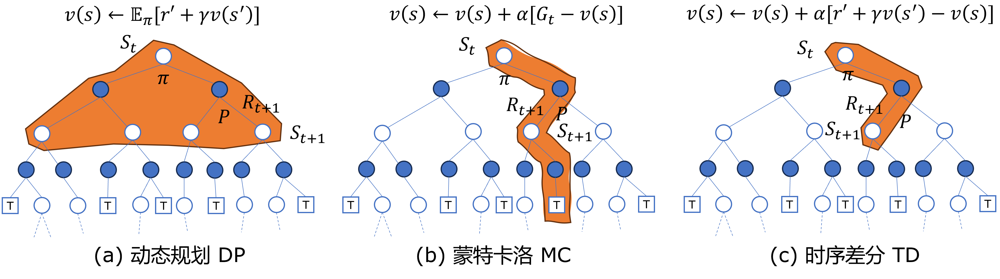
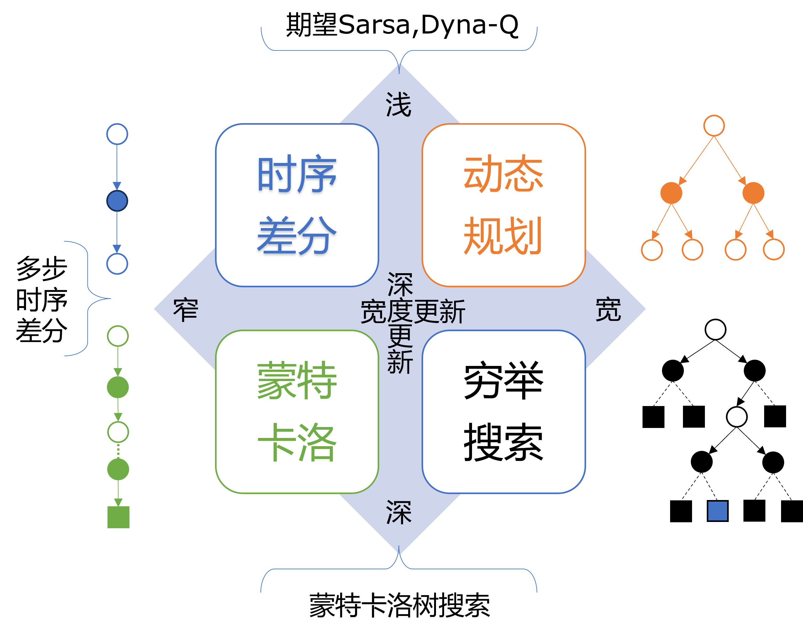
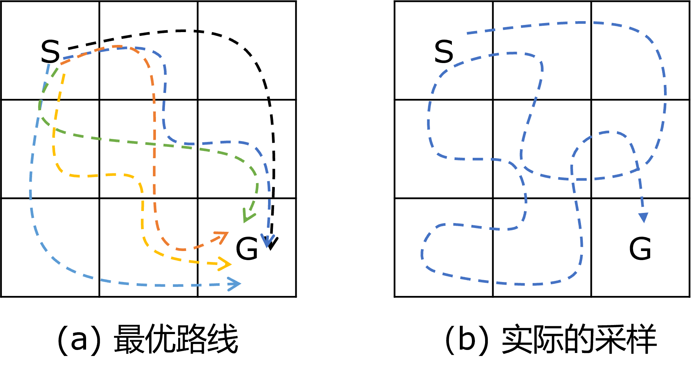
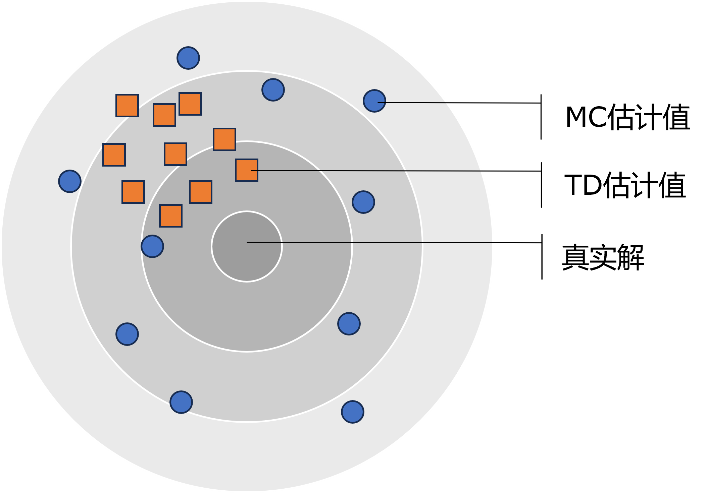

## 12.3 三种方法的对比

本章中的“表格学习问题”，并不是一个具体的问题，而是要把到本章为止本书前面讲的强化学习方法做一个总结。在前面的章节中学习了动态规划（DP）、蒙特卡洛（MC）、时序差分（TD）三种方法，下面做个对比。


图 12.3.1 展示了这三种方法的示意图。



图 12.3.1 DP、MC、TD三种方法的对比

### 12.3.1 动态规划

从图 12.3.1 (a) 图，可以看到 DP 算法是要遍历到每个节点的，图中的红色区域没有画到底部，是因为 DP 算法属于单步期望更新，在计算 $S_t$ 的价值函数时但是必须保证宽度，图中的 $\pi$ 和 $P$ 必须要已知并被用于计算。即，红色区域内位于下层的全部节点决定了上层节点的价值。当需要计算 $S_{t+1}$ 的价值函数时，就需要把这个红色三角形区域“挪下来”，以该节点为顶点。所以，DP 方法像一个统揽全局的将军。

它有以下特点。

- 动态规划法主要是使用贝尔曼方程、贝尔曼期望方程、贝尔曼最优方程，针对有模型的问题进行迭代求解。

- 它需要以转移概率为基础进行自举的、遍历式的迭代计算，速度快，精度高，不需要采样。

- 每次计算都会涉及到所有的状态节点，而不能单独计算某个节点的状态价值。

- 擅长解决循环依赖问题，比如当一个环境没有终止状态时，如穿越虫洞问题。

### 12.3.2 蒙特卡洛

从图 12.3.1 (b) 图，可以看到 MC 算法“一条路走到黑”，到达终点 $T$ 后，可以从后向前计算出所经历的每个节点的价值，多次采样不同或相同（不可控，由环境决定）的路径后求平均值，因此它完全符合价值函数的定义，是无偏的。图中的 $T$ 并非意味着这个环境有多个终止状态，而是表示不同的采样过程。所以 MC 方法像一只侦察小分队，一直深入到敌后方。

它有以下特点。

- 当环境未知（无模型）时，DP 无能为力，只能使用 MC，是高方差、无偏差的方法。

- 即使是有模型时，但转移矩阵很难定义或计算困难，也可以从 MC 采样的轨迹中进行学习。

- 不管整体的状态数量有多少，每次只计算一个状态的价值。

- 需要采样完成一幕后才可以开始学习，不能自举，所有只能处理有终止状态的问题。

- 有更好的收敛性质，总能够很好的拟合函数，能够更容易接近真实的价值函数，但收敛速度比较慢。

- 对初始化数据不敏感，因为标注是真实的，所以最后总会调整到正确的轨道上。

### 12.3.3 时序差分

从图 12.3.1 (c) 图，可以看到 TD 方法的路径与 MC 方法一致，不同的是，它每走一步，就根据仅有的条件计算一次价值函数，一直到遇到 $T$ 为止，然后再新开一条探索之路。它通常适用于每一步都有奖励的环境，可以得到及时的反馈。所以 TD 方法像一个战地医生，来一个伤员就快速处理一个，看似草率，实际上从总体上看这种方法平衡了医疗药品短缺、时间紧迫、挽救生命直接的关系。

它有以下特点。

- 可以处理无模型问题，可以处理没有终止状态的问题，是有偏差、低方差的方法。

- 不需要等到采样结束后才学习，可以自举，每采样一步都可以学习。

- 速度比较快，因为数据的方差比较小，而我们一般认为收敛的准则是：当数据的波动比较小，则认为收敛了。但是对初始化数据比较敏感，如果有一个不好的初始化值，虽然可以很快收敛，但不是收敛到正确的解。

### 12.3.4 三种方法的联系

从表 12.3.1 中，可以看到为了完成相同的任务，三种方法都各用了什么公式。看上去截然不同，但是回想每一章中的解释，其实都是从基本的定义（MC 列）推导或推演出来的。

表 12.3.1 三种方法的联系

|任务|DP|MC|TD|
|-|-|-|-|
|$v_t$|贝尔曼方程|$v_t(s) \doteq \mathbb E [G_t \mid S_t = s]$|TD(0): $v(s) \leftarrow r' + \gamma v(s')$|
|$v_\pi,q_\pi$|贝尔曼期望方程|$v_\pi(s) \doteq \mathbb E [G_t \mid S_t=s]$<br>$q_\pi(s,a) \doteq \mathbb E [G_t \mid S_t = s, A_t=a]$|Sarsa: $q(s,a) \leftarrow r' + \gamma q(s',a')$|
|$q_*$|贝尔曼最优方程|$q_*(s,a) \doteq \max_\pi q_\pi(s,a)$ |Q学习: $q(s,a)\leftarrow r'+\gamma \max_{a'}q(s',a')$|

图 12.3.2 展示了三种方法的内在联系。



图 12.3.2 三种方法的联系

图 12.3.2 中：

- 左上角的时序差分方法，在宽度和深度上都处于最浅、最窄的位置；

- 左下角的蒙特卡洛方法，最窄，但是最深。在这两者之间存在多步时序差分方法，是本章中要讲述的；

- 右上角是动态规划方法，它很宽，但是很浅，只管一层；

- 右下角是即宽又深的穷举搜索方法，一般在大型问题中无法使用，只是一个理想的存在。

在中间的混合区域是各种方法的组合，比如：

- 在左侧，多步时序差分就处于时序差分和蒙特卡洛之间；

- 在上端，时序差分中的期望 Sarsa，以及独立的 Dyan-Q 算法，就有动态规划的味道；

- 在右侧，在整个状态树中做回溯，实际上就是动态规划逐层地从上到下应用，也可以到达穷举搜索的目的；

- 在下端，使用无穷多次的蒙特卡洛，或者有策略的蒙特卡洛树搜索，就接近于穷举搜索。

### 12.3.5 方差与偏差

由于 DP 方法使用的是精确的数学推导以及环境数据，所以没有误差。

MC 方法中使用的估计值是源于真实回报的采样，与真实值具有相同的期望，因此 MC 方法是无偏估计，但是方差较高。因为：

$$
G_t = R_{t+1}+\gamma R_{t+2}+\gamma^2 R_{t+3}+ \cdots +\gamma^{T-t-1} R_{T} = \sum_{n=0}^{T-t-1} \gamma^n R_{t+1+n}
$$

以及价值函数 $V$ 的定义：

$$
v_t(s) \doteq \mathbb E [G_t | S_t = s]
$$

$G_t$ 由很多时刻的 $R$ 组成，维度很高。另外，要采样很多次求均值才能近似于期望值。方差来源于三个方面：环境回馈奖励的不确定性、环境转移概率的不确定性、策略选择的不确定性。MC 方法将之后每一次与环境交互产生的方差都引入到了更新中，所以估计量的方差随着 n 的增大不断增加，而偏差随着 n 的增加不断减小。

图 12.3.3 展示了一个简单的方格世界的问题：从 S 出发，随机游走，出界返回，每一步的移动奖励 -1，到达 G 后结束一幕，无折扣。请问：从 S 到 G 一共有多少种走法？



图 12.3.3 一个简单的3×3的方格世界

聪明的读者可以立刻画出如子图（a）的最优路线，并信誓旦旦地说：一共有六种走法。但是，如果用 MC 方法对环境采样的话，会得到一条子图（b）的路线，于是一个不祥的预感产生了：天呀！这种组合到底有多少？！笔者也很好奇，于是用方格世界的模型做了一个简单的试验，结论是：有无数种走法！见【代码：Table_5_MC_Var.py】。

表 12.3.1 采样幕数和走法的对应关系

|次数|100|200|300|400|500|600|700|800|900|1000|
|-|-|-|-|-|-|-|-|-|-|-|
|走法|100|199|293|388|483|577|671|765|858|952|
|比例|100%|99.5%|97.7%|97%|96.6%|96.2%|95.8%|95.6%|95.3%|95.2%|

从表 12.3.1 可以看到：采样 100 幕时，居然有 100 种走法！随着采样幕数的上升，走法的数量比例略微下降，最后在 1000 幕时达到 95% 左右。也就是说，对于 S 来说，1000 幕采样中有 952 种不同的 $G$ 值（如果步数相同则 $G$ 值计算结果相同），那么方差将会很大。读者可以自行运行代码来观察方差的变化结果。


TD 方法的基础是贝尔曼方程，自举的初始化是任意的，与真实值是无关的，因此是有偏估计，随着更新的不断迭代，不断的加入环境反馈来的真实值，这个偏差依概率衰减至稳定。

TD 以自举的方式引入了方差，即：

$$
v(s) \leftarrow v(s)+\alpha[r+\gamma v(s') -v(s)]
$$

但是 TD 方法比较简单，一般来说，简单的模型会有一个较大的偏差和较小的方差，复杂的模型偏差较小方差较大。

下面我们通过试验来得到结论：使用冰面滑行 8X8 环境中的困难模式，在同一段采样代码中，既计算 MC 的值，又计算 TD 的值，一共 10000 幕，重复 10 次。见【代码：Table_1_MC_TD_error.py】。

下面是 10 次试验结果的RMSE误差（以 DP 的结果作为基准）：
```
---------------10次试验的结果的RMSE误差---------------
MC: 0.0534|0.0538|0.0258|0.0846|0.0229|0.0552|0.0595|0.0539|0.0789|0.0549|
TD: 0.0539|0.0547|0.0334|0.0426|0.0445|0.0538|0.0585|0.0537|0.0467|0.0539|
```
从误差结果看，MC > TD 的次数是 6，MC < TD 的次数是 4，**误差基本上是不相上下**。

下面是 10 次试验结果之间的方差，一共 $8\times 8=64$ 个状态，所以一共计算出 64 组方差。但是一组一组对比的话没有什么意义，所以求它们的平均值以及比值的平均值：
```
---------------MC 10次试验各个状态的平均方差---------------
0.0030801986246545236
---------------TD 10次试验各个状态的平均方差---------------
0.00021523997989740656
---------------MC/TD 10次试验各个状态的方差的比值的平均值---------------
33.716500358772656
```
可以看到 **MC 的方差比 TD 的方差大一个数量级**。

最后再比较 10 次试验的平均值的误差：

```
---------------MC 10次试验各个状态平均值的误差---------------
0.014255165744719352
---------------TD 10次试验各个状态平均值的误差---------------
0.047905916924684745
```

可以**看到 MC 的误差比 TD 的误差小**。

由误差分解公式可知：

$$
误差 = 方差 + 偏差^2 + 随机误差
$$

由于在本例中环境是稳定的，没有随机误差，MC 的方差比 TD 的方差大，MC 的误差比 TD 的误差小。所以，**MC 的偏差一定比 TD 的偏差小**。如图 12.3.3 所示。



图 12.3.3 方差与偏差

图 12.3.3 中的小圆点表示 MC 的 10 组试验结果，方差较大（相互之间的距离大），偏差较小（它们都在中心周围，其平均值会很接近圆心）；小方块表示 TD 的 10 组试验结果，方差较小（相互之间的距离小），偏差较大（整体偏离了背景圆的中心，平均值也会偏离真实值）。

### 12.3.6 如何判断收敛条件

在无模型问题中总会有这样的疑问：基于 MC 的高方差和 TD 的高偏差，没有能衡量正确性的标准，那么采样多少幕（或者多少步）才算何时呢？

因为没有一个基准值可以比对，所以不知道价值函数估算到什么程度才算准确。如果用前后两轮价值函数的相对误差来衡量的话，因为方差偏差等误差问题，这个相对误差可能会忽大忽小，并不稳定，所以也不能用于判断是否收敛。在 DP 算法中，误差逐渐缩小有一个非常稳定的趋势，所以可以这样做，但 MC 和 TD 算法中不行。

那么可以思考一下在强化学习问题中，我们看到的实实在在的东西是什么？是奖励！如果我们观察每一幕的平均回报值，当它的波动缩小到一个范围的时候，就认为是收敛了。比如在悬崖漫步问题中，对于 Sarsa 算法是在 -15 到 -20 之间。通过记录并显示出这个平均回报值，就可以判断时候要结束采样。

