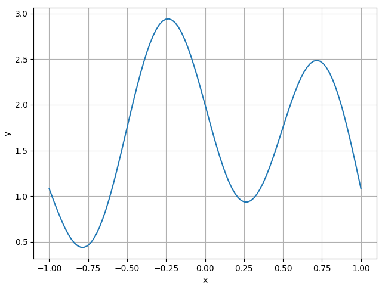
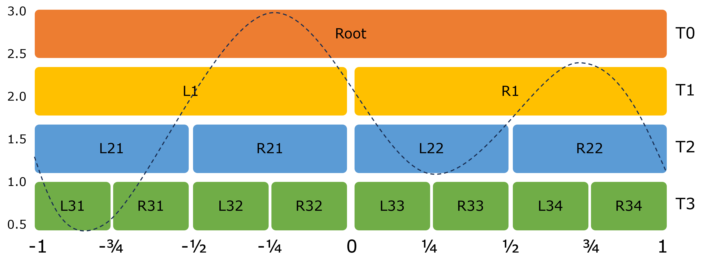
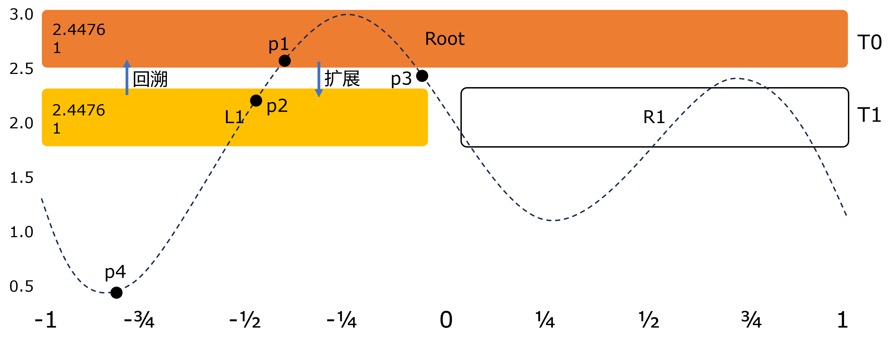
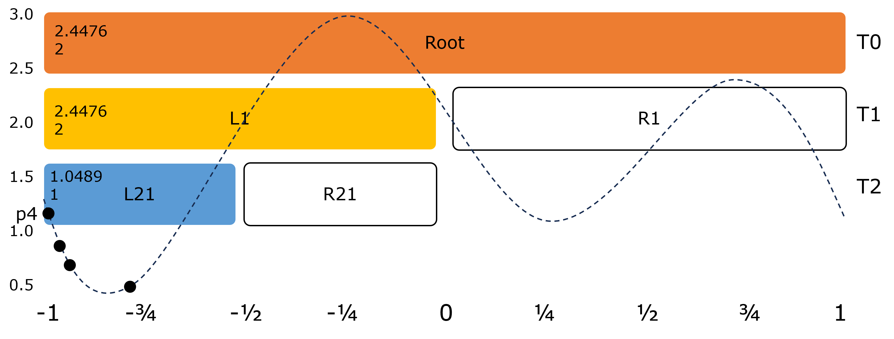
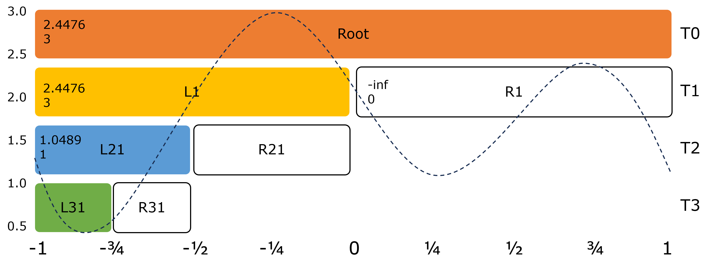
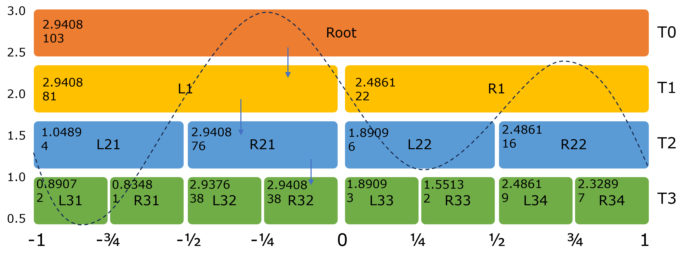
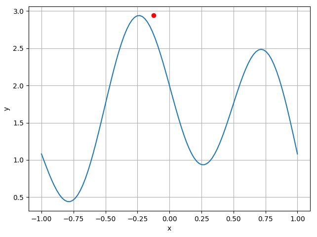

## 12.4 蒙特卡洛树搜索

在第 12.3 节中提到了位于蒙特卡洛方法与穷举搜索之间的蒙特卡洛树搜索（Monte Carlo tree search，MCTS），在著名的 AlphaGo 中，就采用了这种算法，它是一种启发式搜索算法，特别适合于像围棋这样复杂的棋类游戏。但是，如果直接使用棋类游戏来讲解该算法，由于维度太高不容易理解，所以我们先用 MCST 来解决一个简单求函数极值问题。

对于下述函数：

$$
y = 2\cos(x)-\sin(2 \pi x)
\tag{12.4.1}
$$

我们想求它在 $[-1,1]$ 之间的极值，其函数图像如图 12.4.1 所示。



图 12.4.1 式（12.4.1）在 $[-1,1]$ 区域的函数图像

如果对式（12.4.1）求导再令导数为 0，得到下式：

$$
y'=-2\sin(x)-2\pi \cos(2\pi x)=0
\tag{12.4.2}
$$

但是这是一个超越方程，没有简单的解析解。所以，我们用最简单的数值遍历的方法得到近似极值。首先定义函数：

```python
def func(x):
    return 2*np.cos(x) - np.sin(2*x*np.pi)
```

然后遍历 $[-1,1]$ 之间的函数值，得到最大值：

```python
def get_best_x(start, end, step):
    x = np.linspace(start, end, step)
    y = func(x)
    max_index = np.argmax(y)
    return x[max_index], y[max_index]

if __name__ == '__main__':
    # 画出函数图像
    draw_func(-1, 1, 100)
    x, y = get_best_x(-1, 1, 100)
    print(f"Best x: {x}, Best y: {y}")  
```

结果如下：

```
Best x: -0.2323, Best y: 2.9401
```

当然，也可以用蒙特卡洛采样法来随机获得 $x$ 对应的 $y$ 值，然后根据比较若干样本得到其最大值。有没有“高级”一些的方法呢？在本节中我们使用MCTS来解决这个简单的问题。由于这是一个一维的问题，所以我们可以用二叉树来实现一个简单的MCTS，如图 12.4.2 所示。注意，二叉树与函数图像（虚线所示）在坐标横轴方向上有对应，与纵坐标无关。



图 12.4.2 用二叉树实现蒙特卡洛树搜索

如果把 $[-1,1]$ 区间分成八等份，那么在纵向上按2的级数可分成四层，即 T0~T3，可按树形结构组织，比如从根节点（Root）分出左右两个子节点 L1、R1，然后再向下继续分割。位于 T3 层的八个节点被称作叶节点，不过，在算法开始时，我们只有一个 root 节点，其下的子节点是根据探索和利用的平衡策略来一步步扩展的。以下是训练部分的主循环代码：

```python
    # 训练
    def train(self, steps=100):
        for n in range(steps):  # 迭代次数
            node = self.root    # 每次都从根节点开始
            while not self.is_terminal(node):  # 是否叶节点
                node = self.traverse(node, greedy=False)  # 遍历、扩展
                score = self.rollout(node)  # 预演得到最优值
                self.back_propagate(node, score)  # 回溯、记录、计数
```

第一步，只有根节点，从它扩展出左右两个子节点 L1、R1，然后返回 L1 做预演和回溯计算，而 R1 会在后续的遍历中被访问到。如图 12.4.3 所示，其中，节点内部左侧的两排数字，第一排是分数，第二排是访问次数。



图 12.4.3 蒙特卡洛树搜索的第一次扩展的结果

以下是遍历、扩展部分的函数，将会在 `self.expand(node)` 一行返回新扩展的节点L1：

```python
    # 遍历树，直到找到一个终止节点，在训练时设置greedy=False
    def traverse(self, node, greedy=False):
        while True:
            if self.is_terminal(node):
                return node
            if not self.is_expanded(node):
                return self.expand(node)
            node = self.get_best_child(node, greedy=greedy)
```

第二步，扩展子节点后会进行预演（rollout），即随机从L1区域 $[-1,0]$ 中选取四个$x$值，根据函数表达式计算它们的$y$值，得到如下结果，即图 12.4.3 中的 p1~p4 四个点：

```
x=[-0.3969, -0.4807, -0.0191, -0.7580]
y=[ 2.4476,  1.8943,  2.1194,  0.4537]
```
然后会从中取最大值作为分数（score），即 2.4476：

```python
    # 从当前节点中找到n个random值，返回当前节点的最优值
    def rollout(self, node):
        scope = node.data.scope
        x = scope[LEFT] + np.random.random(self.rollout_times)*(scope[RIGHT]-scope[LEFT])
        y = self.func(x)
        return np.max(y)
```        

第三步，从 L1 节点开始做回溯（back propagate）。在每个节点被创建时，都会赋予一个 `best_score = -inf` 作为初值，通过与 `score=2.4476` 比较，将会把较大的值作为 L1 节点的新的最优值，并把访问次数计数器加1，代码如下：

```python
    # 回溯更新节点的值
    def back_propagate(self, node, score):
        while True:
            node.data.best_score = max(node.data.best_score, score)
            node.data.visits += 1  # 访问次数+1
            if node.is_root():     # 是根节点时退出循环
                break
            node = self.tree.parent(node.identifier)  # 否则就继续回溯父节点
```

进一步回溯到 L1 的父节点（即根节点时）做同样的比较、记录、计数。接下来判断 L1 节点是否为根节点：

```python
    # 判断当前节点是否是终止节点，终止节点是指当前节点的深度等于最大深度
    def is_terminal(self, node):
        return self.tree.level(node.identifier) == self.max_depth  # 3
```

在本例中返回 False，则继续进行扩展，得到 L21、R21 两个子节点，并在 L21 的区域 $[-1,-0.75]$ 中随机选择四个$x$，计算它们的$y$值，得到以下结果：

```
x=[-0.9069 -0.7006 -0.9226 -0.9931]
y=[ 0.6804  0.5767  0.7403  1.0489]
```

四个点中p4的$y$值最大，作为本节点的最优值，需要回溯其父节点L1以及根节点，但由于 $1.0489 < 2.4476$，所以 L1 和根节点的best_score仍然是上一次得到2.4476，但是访问次数都需要加1，变成2。结果如图 12.4.4 所示。



图 12.4.4 蒙特卡洛树搜索的第二次扩展的结果

后面还要继续扩展 L21 的子节点L31、R31，不再赘述，其结果是 best_score 值不会大于根节点和L1节点的值，但是访问次数会变成3，于是到了图 12.4.5 所示的状态。



图 12.4.5 蒙特卡洛树搜索的第三次扩展的结果

由于我们事先预定了树的结构为四层，所以现在需要回到根节点，进行第二轮的树搜索，即在L1和R1之间选择一个节点进行搜索。此时会引入多臂赌博机中讲解的 UCB 算法：

$$
\text{UCB} = \arg\max_a \Big [Q_t(a) + c\sqrt{\frac{\ln t}{N_t(a)}} \Big ]
\tag{12.4.3}
$$

在这里，我们令 $Q_t$ 为当前节点的最优值，令参数 $c=2$，令 $t$ 为父节点的访问次数，令 $N_t(a)$ 为当前节点的访问次数，代码如下：

```python
    def ucb(self, parent_visits):
        if self.visits == 0:  # 从来没被访问过
            return np.inf     # 所以返回无穷大表示要优先访问
        return self.best_score + self.coef * np.sqrt(np.log(parent_visits)/self.visits)    
```

对于L1节点来说，$2.4476+2\sqrt{\frac{\ln 3}{3}}=3.6579$。而对于R1节点来说，`self.visits=0`，位于被除数位置，所以直接返回正无穷大表示高优先级，那么在函数 `traverse()` 的最后一行 `node = self.get_best_child(node, greedy=greedy)` 就会返回R1节点，则后续需要对R1节点进行扩展、预演、回溯等操作，直到完成指定的训练次数。

当R1没有被访问过时，它一定会被UCB算法选中。所以我们现在假设R1的访问次数为1、最优值为2.0001时，它的计算结果如表 12.4.1 所示。可以看到，即使R1的最优值小于L1的最优值，但由于R1的访问次数只有1次，所以R1的UCB值会较大，那么将会选择R1分支进行后续的搜索。

表 12.4.1 假设情况下的L1、R1的UCB计算

|子节点|访问次数|最优值|父节点访问次数|UCB值|
|-|-|-|-|-|
|L1|3|2.4476|3|3.6579|
|R1|1|2.0001|3|4.0964|

经过100次迭代后，最后得到结果如图 12.4.6 所示，其中，每个节点内的左上角的两个数字分别代表最优值和访问次数。



图 12.4.6 蒙特卡洛树搜索的最终结果

训练完毕后，通过以下代码获得最优值：

```python
    # 训练完毕后获得最优值
    def get_optimal(self):
        node = self.traverse(self.root, greedy=True)
        return np.mean(node.data.scope), node.data.best_score
```

由于设置了 `greedy=True`，所以在根节点会选择最优值较大的L1子节点，再向下依次选择R21、R32，所以最优值来自R32节点，如图 12.4.6 中的三个向下的箭头所示。那么$x$的取值就在 $[-0.25,0]$ 区间内，极值为 $y=2.9408$。结果如图 12.4.7 所示。



图 12.4.7 函数的极值点

为什么极值点不在函数曲线上呢？是因为最后使用 `np.mean(node.data.scope)` 方法来得到 $[-0.25,0]$ 的中间值 $x=-0.125$。为了改进这一点，可以通过把原始的$x$值记录下来以得到更精确的解，也可以通过增加树的层数来改进。本例中$y$值还是比较准确的，如果$y$值不准确，则需要增加训练迭代步数或者预演时的 `rollout_times` 次数来改进。代码详见【代码：】

