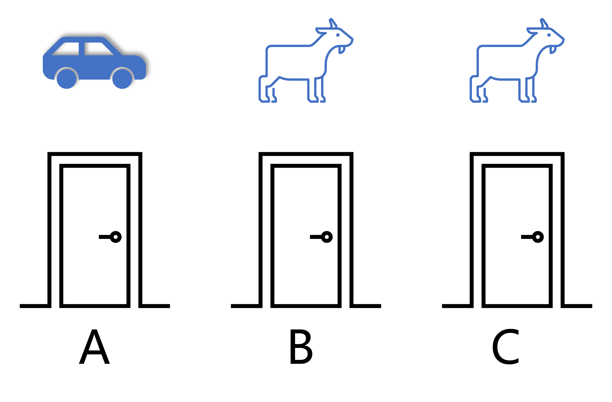

## 1.1 蒙提霍尔问题

三门问题——亦称为蒙提霍尔问题，出自美国的电视游戏节目 Let's Make a Deal（一锤定音），问题的名字来自该节目的主持人蒙提·霍尔（Monty Hall），他设定的游戏场景是这样的：

参赛者面前有三扇关闭着的门，其中一扇的后面是一辆汽车，选中后面有车的那扇门就可以赢得该汽车，而另外两扇门后面则各藏有一只山羊，如图 1.1.1 所示。当参赛者选定了一扇门，但未去开启它的时候，主持人会开启剩下两扇门中的一扇，露出其中一只山羊。主持人其后会问参赛者要不要换另一扇仍然关上的门。

**问题：换另一扇门是否会增加参赛者赢得汽车的概率？**

图 1.1.1 蒙提霍尔问题

针对上面的问题，我们可以给出下列不存在任何歧义的叙述：

（1）有三扇门A、B、C，只有一扇门后面有汽车，其余两扇门后面都是山羊； 
（2）汽车事先被随机放置于三扇门中的一扇后面（在图1中我们假设汽车在 A 门后面）； 
（3）参赛者在三扇门中挑选一扇。他在挑选前并不知道三扇门后面分别是什么； 
（4）主持人知道每扇门后面有什么； 
（5）如果参赛者挑了一扇有山羊的门，主持人就会挑另一扇有山羊的门打开； 
（6）如果参赛者挑了一扇有汽车的门，主持人随机在另外两扇有山羊的门中挑一扇门打开； 
（7）主持人会问参赛者“是保持他原来的选择，还是转而选择剩下的那一扇门”； 
（8）此时参赛者要做出选择。

问题：转换选择可以增加参赛者拿到汽车的机会吗？

首先说明一点，本问题并不是典型的强化学习问题，而是用概率论就可以解决的问题。但是，通过对这个问题的分析过程和解决途径的学习，我们可以体会到强化学习的一般方法。

### 解题思路

不同背景的人会有不同的解题思路，可以归纳为以下三种。

#### 1. 经验归纳法

有些社会经验的人（他们往往会忘记大学时学习的数学知识），可能会这么想：

- 商家是不会让顾客占便宜的，买的不如卖的精，千万别信；
- 有些人总是利用信息不对称的优势，引（诱）导他人做有些热想到达目的的事，我不能上当；
- 我的第一感觉很准，而且一贯运气不错，我要坚持己见；
- 山羊只吃草，汽车还要烧油，不划算，领一只山羊也不错。

这些思考方向已经超出了本书的范畴，仁者见仁智者见智。

#### 2. 逻辑推理

稍微具备些逻辑头脑的人，可能会这样推理：

- 主持人打开一扇门后，在关闭的两扇门中，其中一个有汽车的概率是$\frac{1}{2}$，所以换不换都没用；
- 一共两只山羊，一辆汽车，所以中奖汽车的概率是 $\frac{1}{3}$，无论主持人耍什么花样；
- 上期节目中，汽车在 A 门，所以本期节目汽车应该在另一扇门。

人们总会混淆数理推导与逻辑推理的关系，用一些并非关键的依据来推导出结论。

#### 3. 简单的穷举法

由于只有三扇门，所以我们不妨穷举所有可能性，如表 1.1.1。

表 1.1.1 穷举所有情况

|情况|汽车位置|参赛者 初始选择|主持人 打开|参赛者 更换选择|参赛者 最终选择|最终是否 中奖汽车|
|:-:|:--:|:--:|:--:|:--:|:--:|:--:|
|1|A|A|B|是|C|否|
|2|A|A|B|否|A|是|
|3|A|A|C|是|B|否|
|4|A|A|C|否|A|是|
|5|A|B|C|是|A|是|
|6|A|B|C|否|B|否|
|7|A|C|B|是|A|是|
|8|A|C|B|否|C|否|

我们用表 1.1.1 中的两种情况举例说明。

- 第 1 种情况：汽车在 A 门后；参赛者选择了 A 门；主持人可以打开 B 和 C 门，假设他打开了 B 门，露出一只山羊；主持人问参赛者是否要更换选择；参赛者更换了选择，从 A 换到了 C；没有中奖汽车，领走了一只咩咩叫的山羊。

- 第 5 种情况：汽车在 A 门后；参赛者选择了 B 门；主持人只能打开 C 门，露出一只山羊；主持人问参赛者是否要更换选择；参赛者更换了选择，从 A 换到了 B；中奖汽车！

根据表 1.1.1 中的数据进行简单的统计，看“参赛者是否更换选择”一列：有 4 种情况选择 是，中奖 2 次，50%；有 4 种情况选择 否，中奖 2 次，50%。

所以“**是否中奖**”与“**更换选择**”没有一致性，从而得到（错误的）结论：**无论是否更换选择，中奖汽车的概率都是 $\frac{1}{2}$**。当汽车在 B 门或 C 门后时，情况与表 1.1.1相同，读者可以自己推导一下，在此不再赘述。

似乎问题到此可以结束讨论了，电视台和主持人似乎只是把中奖游戏又换了个花样以便赢得电视观众的收视率。但情况真的如此吗？
