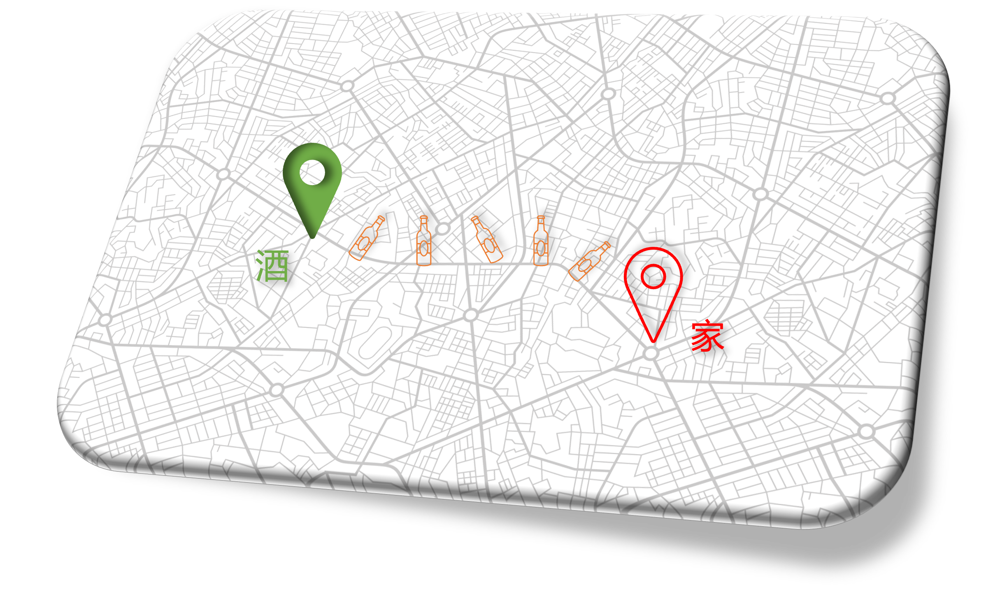
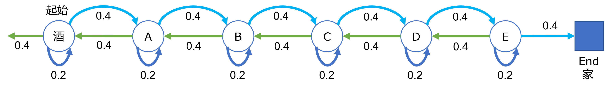

## 3.1 醉汉回家问题

有一个喜欢喝酒的大叔下班后经常去酒馆喝酒，家也离酒馆比较近，就在一条街上，从酒馆出发向东走 50 步就能到家，如图 3.1.1所示。



图 3.1.1 醉汉回家问题

但是由于大叔每次都喝醉了酒，在回家的路上步履蹒跚，像是一个东倒西歪的酒瓶子，每个时刻他可能向前走的概率是 0.4，向后走的概率是 0.4，在呆在原地不动的概率是 0.2。

**问题：他从酒馆出发能走到家的概率是多少？**

### 3.1.1 建立模型

在第 2 章中已经学习了转移概率矩阵的知识，在此，我们把醉汉回家的过程用状态及转移概率绘制出来，如图 3.1.2。



图 3.1.2 醉汉回家问题的状态转移示意图

图 3.1.2 是个示意图，并没有画出完整的 50 步，只画了 6 步。左侧起点为（酒），代表酒馆；右侧终点为方框，代表家；中间有 A、B、C、D、E 五个节点；每个节点都有向前、向后、原地不动三种选择，概率用数字表示；从酒馆开始允许向相反方向走；到家后就不会再出来。

### 3.1.2 代码模拟

从表面上看，醉汉可能会向前走一步，又向后一步，然后原地愣一下，......，这样的话，他从酒馆出发，永远也回不到家，因为“平均值”就在酒馆附近。真的是这样吗？不善于理论推导的话，可以发挥编程能力，写一段代码来模拟这个醉汉，见【代码：RandomWalker_1_Reverse.py】。

```Python
# 从酒馆出发,允许向家的相反方向走
def RandomWalker(distance=50):
    position = 0    # 距离酒馆的位置，为50时表示到家
    counter = 0     # 行走的步数（包括原地不动）
    trajectory = [] # 行走的路径
    while(position < distance): # 判断是否到家
        # 随机选择向前(1)向后(-1)不动(0), 概率是[0.4,0.2,0.4]
        step = np.random.choice([-1, 0, 1], p=[0.4, 0.2, 0.4])
        position += step    # 更新位置
        counter += 1        # 更新步数
        trajectory.append(position) # 记录位置

    # 输出最后位置和步数，计算位置平均值
    print(str.format("步数 : {0}\t最远 : {1}\t平均步数 : {2}", 
          counter, np.min(trajectory), np.mean(trajectory)))
 
if __name__ == "__main__":
    for i in range(10):     # 试验10次
        RandomWalker(50)
```

运行上述代码，可以得到十次试验结果如下：

```
步数 : 1404     最远 : -11      平均位置 : 13
步数 : 5854     最远 : -40      平均位置 : -5
步数 : 8312     最远 : -84      平均位置 : -15
步数 : 7645     最远 : -70      平均位置 : -7
步数 : 5420     最远 : -36      平均位置 : 8
步数 : 1419     最远 : -4       平均位置 : 16
步数 : 22170    最远 : -114     平均位置 : -41
步数 : 1699     最远 : -13      平均位置 : 9
步数 : 128704   最远 : -276     平均位置 : -92
步数 : 1034     最远 : -1       平均位置 : 25
```

从运行结果中可知最重要的一点是，在十次试验中醉汉都到家了！否则代码不会停止运行。这违反了人们的直觉。比如：

- 第一次试验结果，走了 1404 步，最远走到了酒馆东侧 11 步的地方，历史路径的平均位置是 13；

- 第二次试验结果，走了 5854 步，最远走到了酒馆东侧 40 步的地方，历史路径的平均位置是 -5；

- ......

**这个结果说明了醉汉是一定可以到家的**，但是步数和平均位置的方差很大，而且平均位置并非在酒馆附近。读者在运行这个程序时，可能会得到不同的试验数据，这是正常的，因为随机过程不同。
