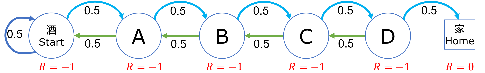

## 4.8 期望奖励方式研究【电子资源】

有了价值函数后，可以对一个强化学习问题模型中的状态有了可以衡量的标准，更深刻地理解算法原理。但是读者可以明显地感觉到，奖励函数的设计对状态价值函数有着根本性的影响，一个合理的奖励函数设计可以让问题尽快收敛得到答案。在接下来的三个小节中，我们一起做一些比较简单的试验，来深刻体会奖励函数与状态价值函数的关系。

安全驾驶问题有些复杂，状态转移太多，所以我们用前面的醉汉回家问题再简化一下来做研究。

状态定义如下，简化为一共 6 个状态，见【代码：SD_7_R2_1.py】：

```Python
# 状态定义
class States(Enum):
    Start = 0
    A = 1
    B = 2
    C = 3
    D = 4
    Home = 5    # 终止状态
```

状态转移矩阵定义如下：

```python
# 状态转移矩阵
P = np.array(
    [  # S    A    B    C    D    Home     
        [0.5, 0.5, 0,   0,   0,   0  ], # S
        [0.5, 0,   0.5, 0,   0,   0  ], # A
        [0,   0.5, 0,   0.5, 0,   0  ], # B
        [0,   0,   0.5, 0,   0.5, 0  ], # C
        [0,   0,   0,   0.5, 0,   0.5], # D
        [0,   0,   0,   0,   0,   1  ]  # Home(End)
])
```

即，左右各有 0.5 的概率随机游走。

接下来我们会设计三组不同的方式来做比较。

### 4.8.1 方式一

所谓期望奖励，就是根据应用场景的需要，直接给状态设定奖励，$S \to R$，而不管其过程如何。具体设置为：**只有到达家的期望奖励设置为 +1，其它状态的奖励都是 0。**

如图 4.8.1 所示。


图 4.8.1 期望奖励方式一

期望奖励值定义如下，见【代码：SD_7_R2_1.py】：

```Python
# 期望奖励值
#    S, A, B, C, D, H
R = [0, 0, 0, 0, 0, 1]
```

这种方式试图达到的效果是：一旦智能体跌跌撞撞地达到了一次家的状态，可以得到 +1 的奖励，它就会尝到甜头并牢记，在后面的学习中会不断强化这种记忆和过程。采样 1000 幕求平均后的各个状态的价值函数如表 4.8.1 所示。

表 4.8.1 期望奖励方式一的结果

|状态$\to$|Start|A|B|C|D|Home|
|-|-|-|-|-|-|-|
|$\gamma=1$|0.0|0.0|0.0|0.0|0.0|1.0|
|$\gamma=0.9$|0.0|0.0|0.0|0.0|0.0|1.0|

结果讨论：

- Home 状态价值不为 0，这是不正确的。尽管我们可以通过修改代码来避免计算 Home 状态的价值，但是我们仍然希望可以找到更好的奖励方式来避免这个错误；

- $\gamma=1$ 时各个状态的价值都是 0，基本上没有意义；

- $\gamma=0.9$ 与 $\gamma=1$ 时 相同，也没有意义。

### 4.8.2 方式二

既然第一种奖励值设计有错误，我们把所有的奖励值都减 1，会不会是同样的效果呢？如图 2 所示。



图 4.8.2  期望奖励方式二

在代码中设置奖励值如下，见【代码：SD_7_R2_2.py】：

```python
# 期望奖励值
#    S,   A,  B,  C,  D, H
R = [-1, -1, -1, -1, -1, 0]
```
有的读者可能会问：D 状态距离终点最近，为什么它的奖励值不会比别的状态高呢？

这是因为到了 D 状态后，也不是一定可以到家，虽然可以到家的概率较其它状态要大。智能体（醉汉）到达 D 后，只知道得到了 -1 的奖励，并不知道下一步向右走就可以到家，读者也不要做这种假设，否则就是替智能体来学习了。另外，不要把期望奖励值和状态价值混为一谈。奖励值没有累加效应，但是状态价值具有全局观察能力。

运行 5000 幕，得到结果如表 4.8.2。

表 4.8.2  期望奖励方式二的结果

|状态$\to$|Start|A|B|C|D|Home|
|-|-|-|-|-|-|-|
|$\gamma=1$|-29.55|-28.02|-23.91|-17.7|-10.24|0.0|
|$\gamma=0.9$|-8.46|-8.09|-7.32|-5.99|-3.69|0.0|

结果解读如下。

- 终止状态 Home 的价值函数值为 0。这是我们希望看到的，也符合定义。

- 情况发生了变化，状态价值并不是在第一种情况的基础上普遍减 1，而是发生了显著的变化，这是因为 $R=-1$ 的不断累加使得远离终止状态的值变得非常小。

- 起始状态 Start 的状态值为什么不是 -1-1-1-1-1=-5 而是 -30 ？因为根据定义，状态函数值是 $G$ 的期望，$G$ 代表了状态变化序列，由于在每个状态上都有 0.5 的概率返回上一个状态，所以状态变化序列（即马尔科夫链）会变得非常曲折，就会让 -1 这个值累加得越来越大。

- 还有一个细节，当 $\gamma=1$ 时，各个状态价值取整后的差值依次以 $-2,-4,-6,-8,-10$ 递减，原因不明（后面的章节再来研究）。

- 从左向右，各个状态的价值依次增加，即距离 Home 越近的状态价值越高，这符合应用场景的期望。

- 折扣的作用：当有折扣存在时，这种负值累加效果会减弱很多，所以当 $\gamma=0.9$ 时，各个状态的函数值的差别会变得比较平缓。

- 正负数：表中的状态价值都是负数，这合理吗？作为一个价值体系来说，正值和负值其实没有绝对意义，相互之间的差值才能够真正体现状态价值。所以只要越靠近终点的状态价值越高，就可以了。

大家在阅读其它强化学习的资料时，通常会看到如情况二这种奖励方式。这也是笔者开始学习时感到不解的地方，经过试验后，想必大家应该明白了其合理性。


### 4.8.3 方式三

还有一个方法可以避免终止状态不为 0 的问题，就是像安全驾驶问题中那样建模：虽然“安全到家”和“发生事故”已经可以看作是终止状态了，但是可以人为地定义一个独立的“终止”状态，令“安全到家”和“发生事故”都以 100% 的概率转移到该终止状态。形成图 4.8.3 所示的模型。


图 4.8.3  期望奖励方式三

把 Home 状态的奖励值设置为 1，其它为 0，看看价值函数计算结果如何。

首先新增加一个 End 状态，见【代码：SD_7_R2_3.py】：

```python
# 状态定义
class States(Enum):
    ......
    Home = 5
    End = 6    # 终止状态
```

然后修改状态转移矩阵，增加从 Home 到 End 的转移：

```python
# 状态转移矩阵（增加了一行一列 for End 状态）
P = np.array(
    [  # S    A    B    C    D    Home End    
        [0.5, 0.5, 0,   0,   0,   0,    0], # S
        [0.5, 0,   0.5, 0,   0,   0,    0], # A
        [0,   0.5, 0,   0.5, 0,   0,    0], # B
        [0,   0,   0.5, 0,   0.5, 0,    0], # C
        [0,   0,   0,   0.5, 0,   0.5,  0], # D
        [0,   0,   0,   0,   0,   0,    1], # Home
        [0,   0,   0,   0,   0,   0,    1]  # End
])
```

设置奖励值：

```python
#  Start, A, B, C, D, H, End（新增）
R1 = [0,  0, 0, 0, 0, 1, 0]
```

主函数部分没有变化，运行 2000 次采样后，得到结果如表 4.8.3。

表 4.8.3 期望奖励方式三结果

|状态$\to$|Start|A|B|C|D|Home|End|
|-|-|-|-|-|-|-|-|
|$\gamma=1$|1.0|1.0|1.0|1.0|1.0|1.0|0.0|
|$\gamma=0.9$|0.16|0.21|0.25|0.42|0.64|1.0|0.0|

结果解读如下。

- 终止状态 End 的价值为 0，符合定义。

- 当 $\gamma=1$ 时，不太理想，因为前面所有的状态值都是 1，不能区分出好坏。

- 当 $\gamma=0.9$ 时，可以区分出状态好坏了，而且各个值似乎是一个等比数列。


接下来，读者可以自己修改奖励值进行更多的试验。尽量保证在 $\gamma=1$ 时，也可以区分出各个状态的价值，最理想的结果是：**离家近的状态应该比离家远的状态的价值高**。

### 4.8.4 小结

首先，终止状态的价值必须是 0，这算是一个硬性规定。如果你希望你的模型的目标状态的价值不是 0，那么就在它的后面再添加一个终止状态，比如方式三。

其次，在上面三种奖励方式中，第二种是最合理的。状态值为负数并没有什么影响，只要有相对大小就可以。

最后，当实在无法区分状态好坏的话，可以用折扣来解决问题。
