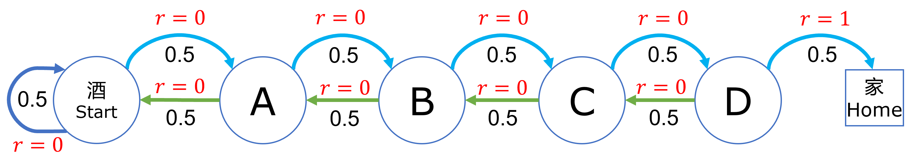
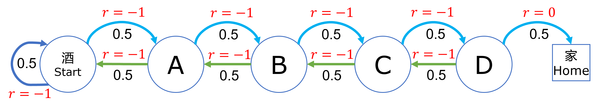
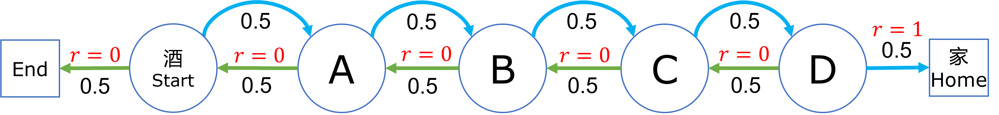

## 4.9 过程奖励方式研究【电子资源】

下面我们研究程奖励方式对价值函数的影响。状态定义和状态转移概率与 4.7 节中相同，只不过奖励不是定义在某个状态上的，而是定义在状态转移过程中的，即 $S \times S' \to r$。

### 4.9.1 过程奖励方式一

假设每走一步都有 0 的奖励，相当于没有任何奖励或惩罚，只有最后一步到家的过程才给 1 的奖励，模型与图 4.7.1 一致，但是奖励定义在过程上，如图 4.9.1 所示。



图 4.9.1 过程奖励方式一

给过程定义奖励，需要用到双重字典如下，见【代码：SD_8_R1_1.py】：

```Python
# 过程奖励值
R = {
    States.Start: {States.Start: 0,    States.A:0},     # S->S:0, S->A:0
    States.A:     {States.Start:0,     States.B:0},     # A->S:0, A->B:0
    States.B:     {States.A:0,         States.C:0},     # B->A:0, B->C:0
    States.C:     {States.B:0,         States.D:0},     # C->B:0, C->D:0
    States.D:     {States.C:0,         States.Home:1},  # D->C:0, D->H:1
    States.Home:  {States.Home:0},                      # H->H:0
}
```

用第一行数据举例，含义是：从 Start 状态开始，到 Start 状态的奖励为 0，到 A 状态的奖励为 0。这样设计的好处是可以用 $O(1)$ 的效率，根据前后两个状态获得奖励值。当然用表格的方法可以达到同样的效果，只不过是一个稀疏表格，手工创建不方便。

同样是每个状态运行 1000 幕后得到结果如表 4.9.1。

表 4.9.1 过程奖励方式一的结果

|状态$\to$|Start|A|B|C|D|Home|
|-|-|-|-|-|-|-|
|$\gamma=1$|1.0|1.0|1.0|1.0|1.0|0.0|
|$\gamma=0.9$|0.17|0.21|0.29|0.45|0.71|0.0|

结果解读如下。

- 当 $\gamma=1$ 时，Home 状态是 0，符合规定了。但为什么前几个状态的价值都是 1 呢？因为根据公式 $v(s)=\mathbb E[R_{t+1}+ R_{t+2} + \cdots + R_T]$，最后的一个 $R_T=1$ 可以作用于前面的所有状态。这样的话，就无法区分状态价值好坏。即，对智能体来说，无法确定性地获得从左向右移动的知识。

- 当 $\gamma=0.9$ 时，在这种奖励函数设计的条件下，令折扣值小于 1，是一个好的办法，可以区分状态价值的好坏。

### 4.9.2 过程奖励方式二

换一种思路，假设每走一步都有 -1 的“奖励”，实际上是惩罚（相当于是很多游戏设计中的体力值降低），意在鼓励智能体（一个还没有接受强化训练的智能体和醉汉没什么区别）尽快找到回家的路，最后累计的负值越小越好。如图 4.9.2 所示。



图 4.9.2 过程奖励方式二

过程奖励值定义如下，见【代码：SD_8_R1_2.py】：

```Python
# 过程奖励值
R = {
    States.Start: {States.Start:-1,    States.A:-1},    # S->S:-1, S->A:-1
    States.A:     {States.Start:-1,    States.B:-1},
    States.B:     {States.A:-1,        States.C:-1},
    States.C:     {States.B:-1,        States.D:-1},
    States.D:     {States.C:-1,        States.Home:0},  # D->C:-1, D->H:0
    States.Home:  {States.End:0},
}
```
采样 1000 幕，运行结果如表 4.9.2。

表 4.9.2 过程奖励方式二的结果

|状态$\to$|S|A|B|C|D|H|
|-|-|-|-|-|-|-|
|$\gamma=1$|-28.98|-27.69|-22.21|-17.11|-9.76|0.0|
|$\gamma=0.9$|-8.28|-7.82|-7.01|-5.54|-3.22|0.0|

结果解读如下。

- 即使在折扣为 1 （无折扣）的情况下，也可以区分出状态值的好坏了。这是因为 -1 奖励值从后向前累积的结果。如果奖励是 0 的话，则没有这种累积效果。

- 使用折扣会使得数据比较平滑，并不会破坏原有的大小关系。

- 经过试验可知，无论最后从 D 到 Home 的过程奖励是多少，都可以保持 Home 的状态价值为 0，符合规范。所以，这种奖励方式比较合理，但是面向状态的奖励方式比较简单易操作，但是要注意合理的奖励设置。

### 4.9.3 过程奖励方式三

如图 4.9.3 所示，在酒馆左侧增加了一个 End 终止状态。



图 4.9.3  状态奖励方式三

状态 D 到 Home 过程奖励为 1，其它全都是 0。这种情况下要重新写代码，主要的变化如下，见【代码：SD_8_R1_3.py】：

```python
# 状态定义
class States(Enum):
    End = 0  # 在酒馆左侧增加一个终止状态
    Start = 1
    ...

P = np.array(
    [  # E    S    A    B    C    D    H       
        [1,   0,   0,   0,   0,   0,   0], # 增加End状态，只能转移到本身
    ...

# 过程奖励值
R = {
    States.End: {States.End:0},
    States.Start: {States.End:0,    States.A:0},
    States.A: {States.Start:0,    States.B:0},
    States.B: {States.A:0,        States.C:0},
    States.C: {States.B:0,        States.D:0},
    States.D: {States.C:0,        States.Home:1},  # 只有此过程奖励为 1，其它都是 0
    States.Home: {States.Home:0},
}
```

采样 5000 幕，运行结果如表 4.9.3。

表 4.9.3 过程奖励方式三的结果

|状态$\to$|End|S|A|B|C|D|H|
|-|-|-|-|-|-|-|-|
|$\gamma=1$|0.0|0.17=$\frac{1}{6}$|0.33=$\frac{2}{6}$|0.5=$\frac{3}{6}$|0.66=$\frac{4}{6}$|0.84=$\frac{5}{6}$|0.0|
|$\gamma=0.9$|0.0|0.06|0.15|0.27|0.43|0.7|0.0|

从表 4.9.3可以看到，当 $\gamma=1$ 时的状态价值相当理想，从 $\frac{1}{6}$ 到 $\frac{5}{6}$ 均匀分布。这也是 Sutton 的书中 6.2 节中的例子。

### 4.9.4 小结

用过程奖励方式要比状态奖励方式合理，可以看到过程奖励中的两种方式都达到了目的，但是第二种方式更好，可以区分出远近关系，距离终点越远，状态值越低。而第一种方式必须通过折扣值才能达到区分值大小的目的。

在另外一端加入一个终止状态，是这种一维空间问题的好的解决方案。

为什么过程奖励方式比状态奖励方式更合理？因为它是起止状态的合集，更能反映出客观世界的真实情况，在设计奖励值时更加容易趋向于合理。注意，合理的奖励并非是给与靠近家的状态转移以较高的奖励值，而是让智能体自己学习。
