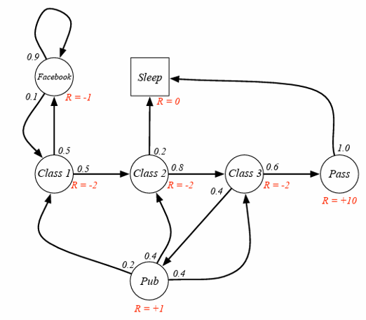

### 思考与练习

1. 使用本章中学习到的贝尔曼方程来解决第 6 章中的安全驾驶问题的状态价值函数计算。
2. 读者可以自行验证图 5.4.3 中的“缺陷”状态的价值函数，以获得深刻理解。
3. 读者可以用贝尔曼方程验证醉汉回家简化版中的状态奖励和价值函数的计算结果。
4. 如果把【代码：CodeFlow_7_Martix_Iteration.py】中的 ```V_new, V_old``` 都用单数组 V 代替，迭代次数会降低吗？为什么？
5. 【大作业】根据下图的 David Silver 课件中的问题设定，使用贝尔曼方程计算当 $\gamma=0,0.5,1$ 时的状态函数。



