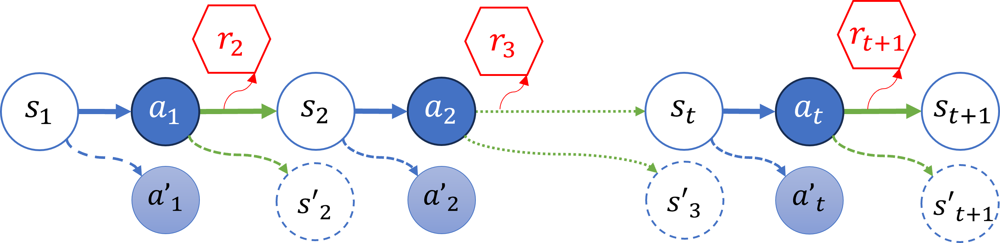
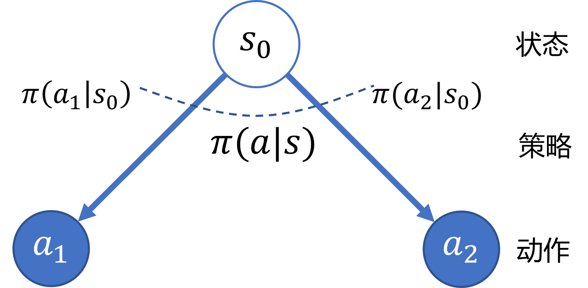
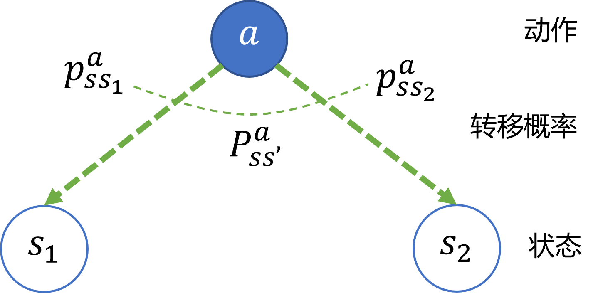
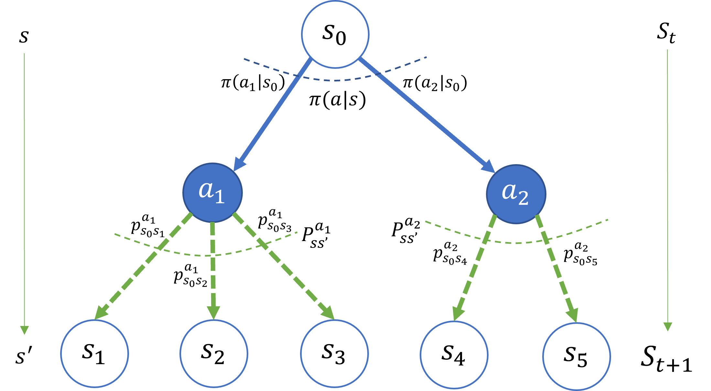
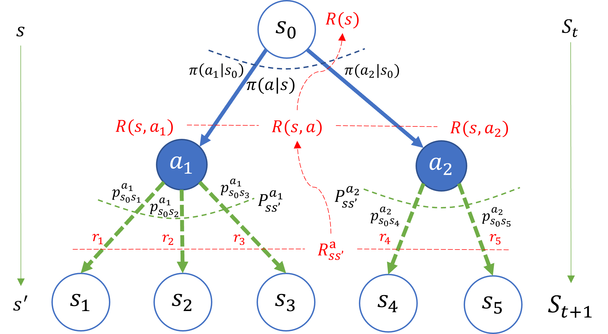

## 6.3 马尔可夫决策过程

### 6.3.1 MDP 描述

图 6.3.1 马尔可夫决策过程

### 6.3.2 策略选择模型（$s \to \pi \to a$）

图 6.3.2 马尔可夫决策过程的策略选择模型

### 6.3.3 状态转移模型（$a \to p \to s'$）

图 6.3.3 马尔可夫决策过程的状态转移模型

### 6.3.4 完整模型（$s \to \pi \to a \to p \to s'$）

图 6.3.4 马尔可夫决策过程的完整模型

### 6.3.5 奖励模型

图 6.3.5 马尔可夫决策过程的奖励模型

