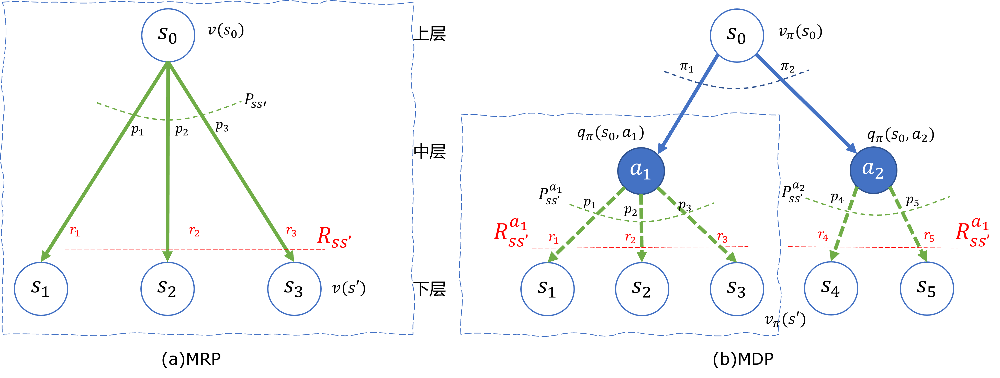
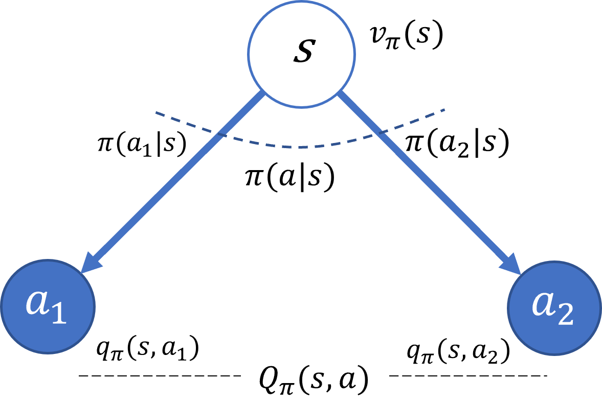
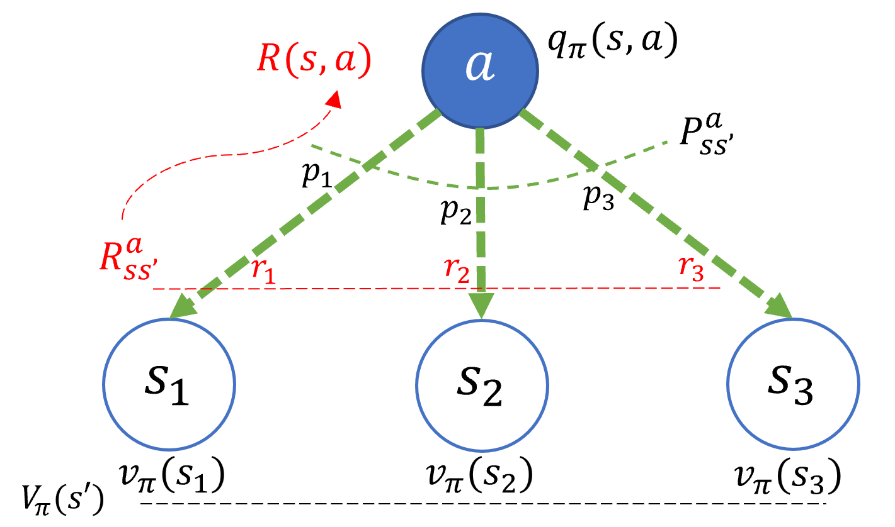
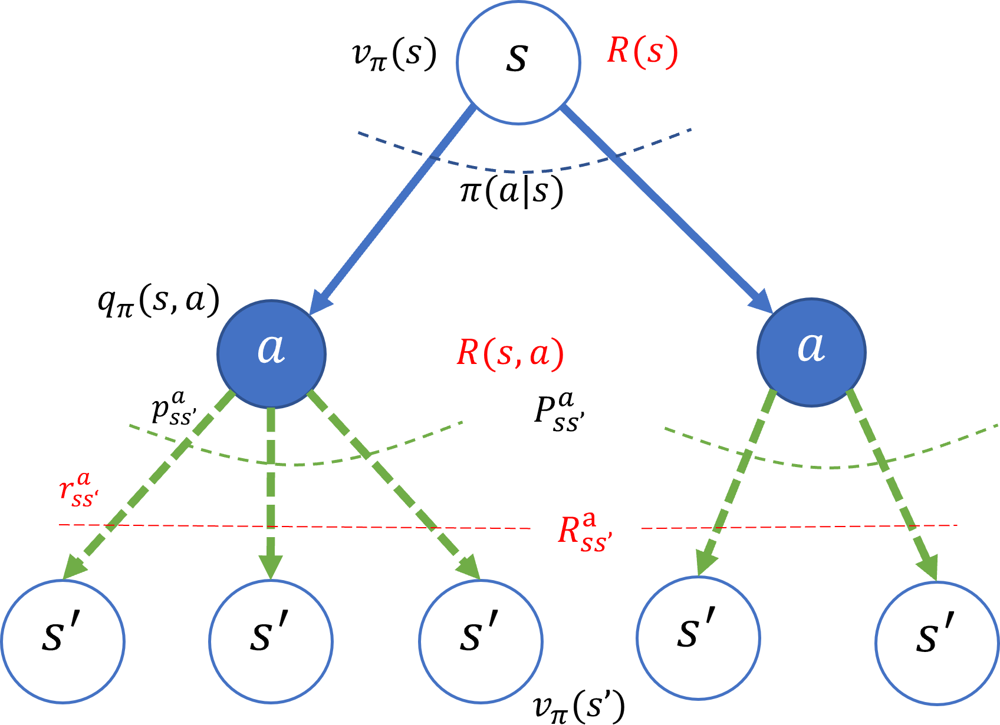
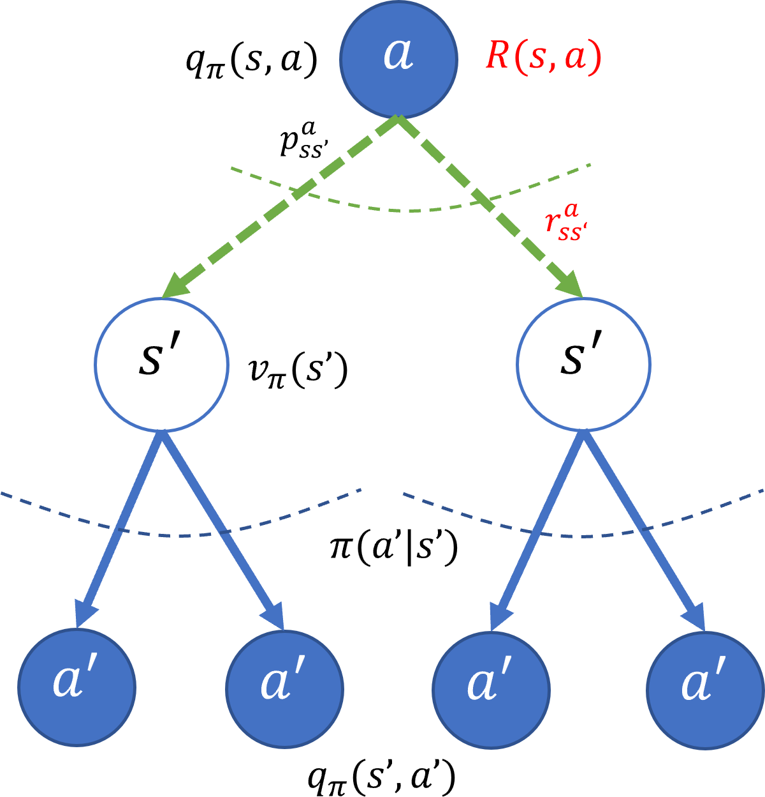

## 6.4 贝尔曼期望方程

### 6.4.1 MRP 和 MDP 的比较

图 6.4.1 MRP 和 MDP 模型的比较

### 6.4.2 推导 $v_\pi$ 表达式

图 6.4.2 马尔科夫决策过程的 $V$ 函数模型

### 6.4.3 推导 $q_\pi$ 表达式

图 6.4.3 马尔科夫决策过程的 $Q$ 函数模型

### 6.4.4 二级回溯

图 6.4.4 $v_\pi$ 的二级回溯图

图 6.4.5 $q_\pi$ 的二级回溯图

