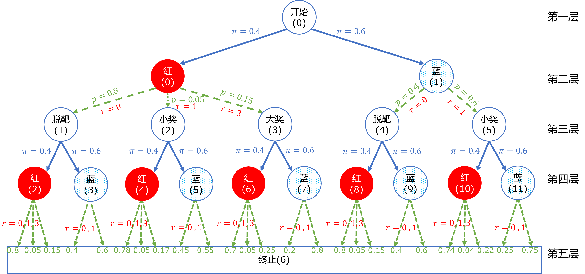
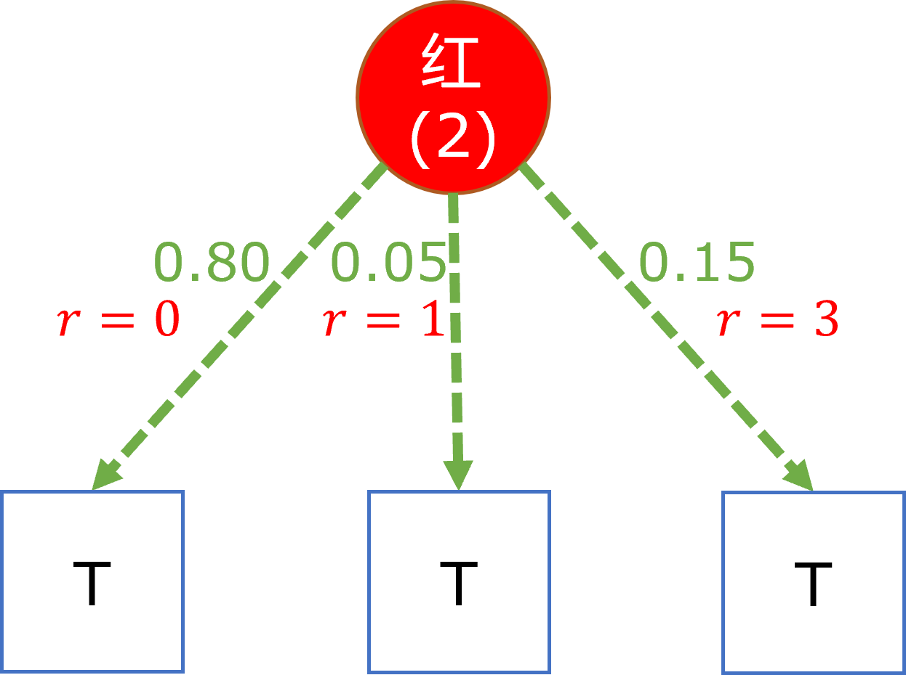
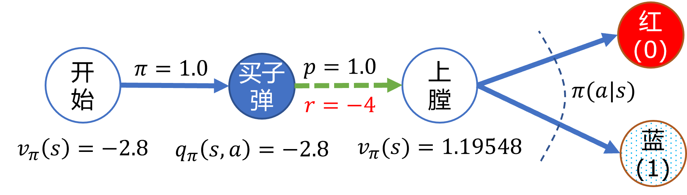

## 6.5 应用贝尔曼期望方程

图 6.5.1 带有动作节点的全模型

### 6.5.1 处于第五层的状态价值函数

图 6.5.2 终点状态

### 6.5.2 处于第四层的动作价值函数

### 6.5.3 处于第三层的状态价值函数

### 6.5.4 处于第二层的动作价值函数

### 6.5.5 处于第一层的开始状态价值函数

图 6.5.3 设计开始状态

图 6.5.4 策略为$[0.4,0.6]$时的价值函数计算结果
