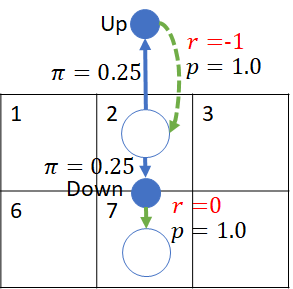

## 7.1 穿越虫洞问题 - 贝尔曼最优方程

在一个 5×5 区域的宇宙空间中，一艘探索太空的宇宙飞船可以任意向四个方向行驶，但是该空间中具有四种不同的类型的区域，如图 7.1.1 所示。

图 7.1.1 穿越虫洞问题

表 7.1.1 描述了这些空间区域的基本特征，环境设置为状态空间 $S=25$，动作空间 $A(s)=4$，随机策略，即 $\pi=\frac{1}{4}$。

表 7.1.1 状态描述

|状态序号|动作选择|奖励|转移|
|-|-|-:|-|
|角落状态|当向中心的方向行驶时，不会发生意外偏航。状态序号 $\{0，4，20，24\}$。|0|动作方向|
||如果在角落处向远离中心的方向行驶，将会碰撞能量屏障 使飞船受损，比如 $s_{24}$ 所示的角落处向右或向下行驶。|-1|原地不动|
|边界状态|当向中心的方向行驶时，不会发生意外偏航。状态序号 $\{1，2，3，5，9，10，14，15，19，21，22，23\}$。|0|动作方向|
||如果在边界处向远离中心的方向行驶，将会碰撞能量屏障 使飞船受损，比如 $s_{9}$ 所示的边界处向右行驶。|-1|原地不动|
|虫洞状态|在 $s_1$ 处进行下一步行驶时，无论任何方向，将无条件地达到 $s_{12}$ 处，但后者并非终止状态。| +5|到 $s_{12}$|
||在 $s_{21}$ 处进行下一步行驶时，无论任何方向，将无条件地 达到 $s_{3}$ 处，但后者并非终止状态。|+10|到 $s_{3}$|
|中心状态|在上述三种特殊状态之外的所有其它状态，比如在 $s_{18}$ 处，如果选择向右行驶，将会达到 $s_{19}$，不会发生意外偏航。|0|动作方向|

**问题：在随机策略下，每个格子的状态价值是多少？确定飞船在每个格子内的最佳移动方向（策略），以获得最大的奖励。**

### 问题分析

注意穿越虫洞问题中的几个特点。

- 没有终止状态，也就是说没有分幕，飞船可以一直行驶。没有终止状态的话，我们无法像第 6.5 节中那样，先确定终止状态的价值函数，进而算出其上游的动作价值函数。所幸在第 6.7 节中，已经写好了计算 $v_\pi、q_\pi$ 的迭代算法了，直接调用即可，但是需要准备好环境。

- 在每个状态（方格）下，可以随机选择 4 个方向中的任意一个移动，即动作空间为 4，动作为“上下左右”，策略概率为 0.25。
- 到达 $s_1、s_{21}$ 时，不是被立刻吸入虫洞，而是要进行下一步动作时才会时空转移。但是在 $s_1、s_{21}$ 并没有机会向其它方向行驶（即无法逃出虫洞）。

关于边角位置的状态，如图 7.1.2 所示，以状态 $s_2$ 为例进行说明：

- 如果从该状态以 0.25 的概率选择向上移动（小实心圆旁标有 Up 字样）出界后，会以概率 1.0 回到 $s_2$，并有 -1 的奖励。所以说，这里面既有策略 $\pi$，又有转移概率 $p$，只不过动作发生后只有一个下游状态，没有分支。即，$p(s_2,-1|s_2,Up)=1$；

- 如果从 $s_2$ 以 0.25 的概率选择向下移动（小实心圆旁标有 Down 字样），会以 1.0 的概率转移到 $s_7$，得到 0 的奖励。即，$p(s_7,0|s_2,Down)=1$。

图 7.1.2 边界状态的动作和概率转移

