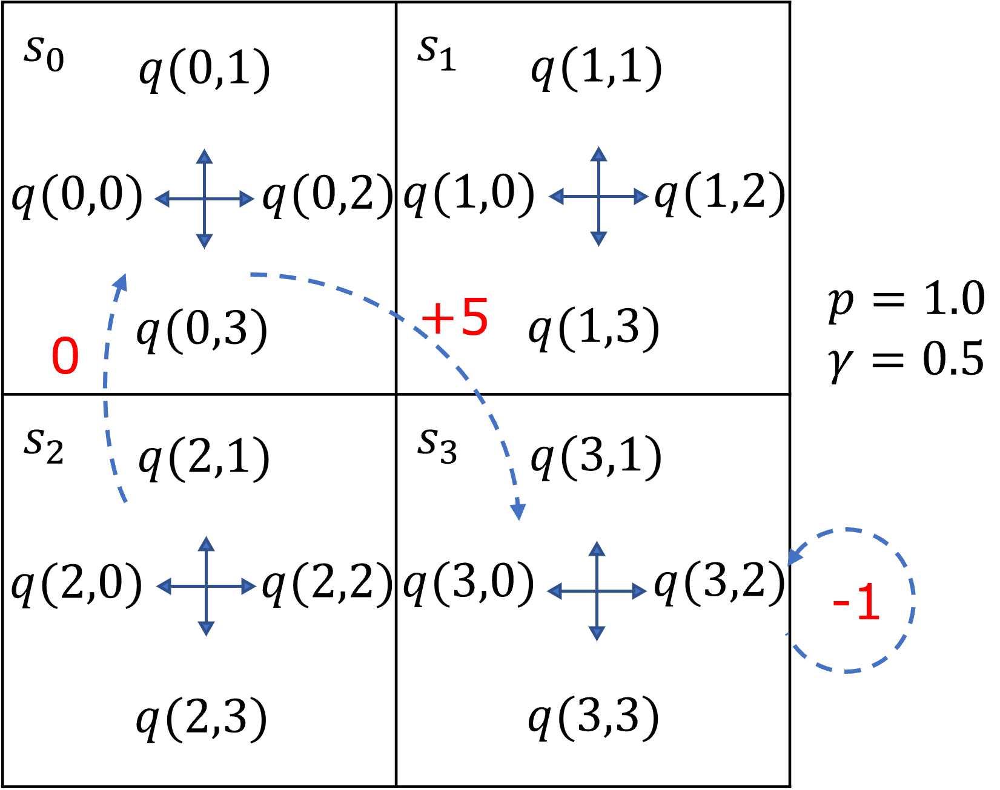

## 7.8 手解贝尔曼最优方程【电子资源】

下面我们就来一起看一贝尔曼最优方程在实际的计算中是如何使用。

本章我们提出了一个穿越虫洞的问题，是一个 5×5 的方格世界，没有终止状态。因为在本节中要进行手算，所以我们简化一下这个问题，把 5×5 变成 2×2 的方格世界，只有一个从 $s_0$ 到 $s_3$ 的穿越可以得到 +5 的奖励，折扣为 0.5，其它设置都是前面的问题一样。如图 7.8.1。



图 7.8.1 简化的穿越虫洞问题

环境描述如下：

- 状态集为 $S=\{s_0,s_1,s_2,s_3\}$，每个状态下都有 4 个动作，动作集合为 $A=\{0,1,2,3\}$，代表“左上右下”；

- 转移概率为 1.0，即，可以准确到达动作方向所在的区域，折扣为 0.5；

- 出界得到 -1 奖励并回到原状态，从 $s_0$ 出发的四个动作都到 $s_3$ 有 +5 奖励，其它奖励为 0；

- 没有定义策略，需要求解。

### 7.8.1 手工运算过程

下面利用式（7.7.1）和式（7.7.3）来求这个问题的最优价值函数 $V_*$ 和最优动作函数 $Q_*$。根据式（7.7.3），列出 $V_*$ 的方程组（7.8.1）：

$$
V_*=
\begin{cases}
v_0=\max [q_{0,0},q_{0,1},q_{0,2},q_{0,3}]
\\
v_1=\max [q_{1,0},q_{1,1},q_{1,2},q_{1,3}]
\\
v_2=\max [q_{2,0},q_{2,1},q_{2,2},q_{2,3}]
\\
v_3=\max [q_{3,0},q_{3,1},q_{3,2},q_{3,3}]
\end{cases}
\tag{7.8.1}
$$

式（7.8.1）中的 $q$ 值列在 $Q_*$ 方程组（7.8.2）中，因为是过程奖励，所以根据式（7.7.1）得到：

$$
Q_*=
\begin{cases}
q_{0,0}=q_{0,1}=q_{0,2}=q_{0,3}=1.0 \cdot (5+0.5v_3)=5+0.5v_3
\\
q_{1,0}=1.0 \cdot (0+0.5v_0)=0.5v_0
\\
q_{1,1}=q_{1,2}=1.0 \cdot (-1+0.5v_2)=0.5v_1-1
\\
q_{1,3}=1.0 \cdot (0+0.5v_3)=0.5v_3
\\
q_{2,0}=q_{2,3}=1.0 \cdot (-1+0.5v_2)=0.5v_2-1
\\
q_{2,1}=1.0 \cdot (0+0.5v_0)=0.5v_0
\\
q_{2,2}=1.0 \cdot (0+0.5v_3)=0.5v_3
\\
q_{3,0}=1.0 \cdot (0+0.5v_2)=0.5v_2
\\
q_{3,1}=1.0 \cdot (0+0.5v_1)=0.5v_1
\\
q_{3,2}=q_{3,3}=1.0 \cdot (-1+0.5v_3)=0.5v_3-1
\end{cases}
\tag{7.8.2}
$$

把式（7.8.2）代入到式（7.8.1）中，并去掉重复项，得到方程组（7.8.3）。所谓重复项，就是 $\max[a,a,b]=\max[a,b]$，则 $a$ 为重复项，去掉一个。

$$
V_*=
\begin{cases}
v_0=\max [5+0.5v_3] &(1)
\\
v_1=\max [0.5v_0,0.5v_1-1,0.5v_3] &(2)
\\
v_2=\max [0.5v_2-1,0.5v_0,0.5v_3] &(3)
\\
v_3=\max [0.5v_2,0.5v_1,0.5v_3-1] &(4)
\end{cases}
\tag{7.8.3}
$$

简化方程组（7.8.3）：

- 由子式(1)得到 $v_0=5+0.5v_3$，因为取最大值时只有一个备选，肯定相等；

- 由子式(2)我们先假设 $v_1 \ge 0$，则 $v_1>0.5v_1-1$，所以有 $v_1=\max [0.5v_0,0.5v_1-1,0.5v_3]=\max [0.5v_0,0.5v_3]$；

- 同理，假设 $v_2 \ge 0$，则式（3）变成 $v_2=\max [0.5v_0,0.5v_3]$；

- 同理，假设 $v_3 \ge 0$，则式（4）变成 $v_3=\max [0.5v_2,0.5v_1]$。

整理为式（7.8.4）：

$$
V_*=
\begin{cases}
v_0=5+0.5v_3    &(1)
\\
v_1= \max[0.5v_0,0.5v_3]    &(2)
\\
v_2= \max [0.5v_0,0.5v_3]   &(3)
\\
v_3= \max [0.5v_2,0.5v_1]   &(4)
\end{cases}
\tag{7.8.4}
$$

进一步简化：

- 由式（7.8.4）子式（2,3）可知，$v_1=v_2$，所以，子式(4)改为：$v_3=\max[0.5v_1,0.5v_2]=\max[0.5v_1,0.5v_1]=\max[0.5v_1]=0.5v_1$；

- 将$v_3=0.5v_1$代入子式(2)，$v_1= \max[0.5v_0,0.5v_3]=\max[0.5v_0,0.25v_1]=\max[0.5v_0]=0.5v_0$，因为前面已经假设 $v_1 \ge 0$，则 $v_1\ge 0.25v_1$，所以可以从 $\max$ 运算中去掉 $0.25v_1$。

再整理一下：

$$
V_*=
\begin{cases}
v_0=5+0.5v_3
\\
v_1=0.5v_0
\\
v_1=v_2
\\
v_3=0.5v_1
\end{cases}
\tag{7.8.5}
$$
解方程组（7.8.5）得：
$$
V_*=
\begin{cases}
v_0=\frac{40}{7} \approx 5.71
\\
v_1=\frac{20}{7} \approx 2.86
\\
v_2=\frac{20}{7} \approx 2.86
\\
v_3=\frac{10}{7} \approx 1.43
\end{cases}
\tag{7.8.6}
$$
进而可以根据式（7.8.2）解得 $Q_*$：
$$
Q_*=
\begin{cases}
q_{0,0}=q_{0,1}=q_{0,2}=q_{0,3} \approx 5.71
\\
q_{1,0}=1 \cdot (0+0.5v_0) \approx 2.86
\\
q_{1,1}=q_{1,2} \approx 0.43
\\
q_{1,3}=1 \cdot (0+0.5v_3) \approx 0.71
\\
q_{2,0}=q_{2,3} \approx 0.43
\\
q_{2,1} \approx 2.86
\\
q_{2,2} \approx 0.71
\\
q_{3,0}=q_{3,1} \approx 1.43
\\
q_{3,2}=q_{3,3} \approx -0.29
\end{cases}
\tag{7.8.7}
$$

即：
```
[5.71, 5.71, 5.71, 5.71]
[2.86, 0.43, 0.43, 0.71]
[0.43, 2.86, 0.71, 0.43]
[1.43, 1.43, -0.29, -0.29]
```
### 7.8.2 结果验证

把 $V_*、Q_*$ 的结果绘制在图 7.8.2 中。每个方格内，处于中间位置的数字是 $v_* $的值，处于四边的数字是 $q_*$ 的值。可以验证：

- $v_*=\max(q_*)$，即中间的数字等于四边的数字中的最大值，且与箭头方向吻合；
- $q_*=p(r+\gamma v_*)$，即每一边上的数字等于奖励值（0、-1、+5 等）加目标方格中心的数字乘以折扣0.5。


图 7.8.2 最优价值函数 $V_*, Q_*$

在图 7.8.2 中同时画出了 $\max(q_*)$ 所代表的动作方向，都和预想的一致，而且所有数值都是以左上右下为轴镜像对称的。至此，我们通过手工运算完成了贝尔曼最优方程的求解过程，希望读者可以自行手写一遍，对于加深概念的理解极为有好处。下一节将会用动态规划法解贝尔曼最优方程。

