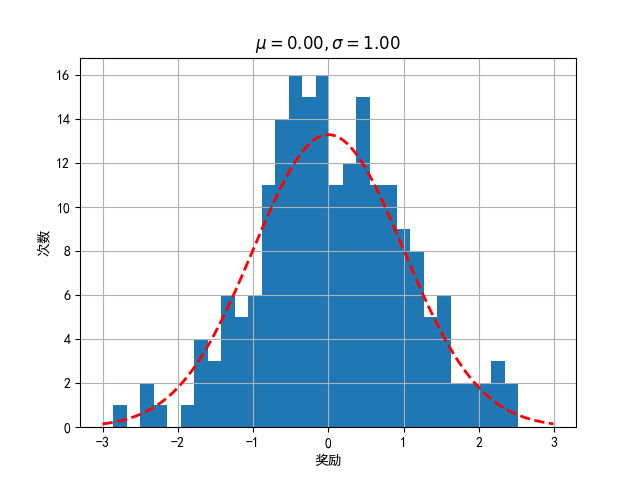

## 8.2 多臂赌博机研究平台

### 8.2.1 固定收益的多臂赌博机

图 8.2.1 固定收益的多臂赌博机

### 8.2.2 分布收益的多臂赌博机

图 8.2.2 收益按概率分布的多臂赌博机

图 8.2.3 收益按概率分布的多臂赌博机的 1 号臂

图 8.2.4 收益按概率分布的多臂赌博机的三个臂

### 8.2.3 上下文赌博机（Contextual Bandits）

图 8.2.5 普通多臂赌博机与上下文赌博机

### 8.2.4 其它变种
