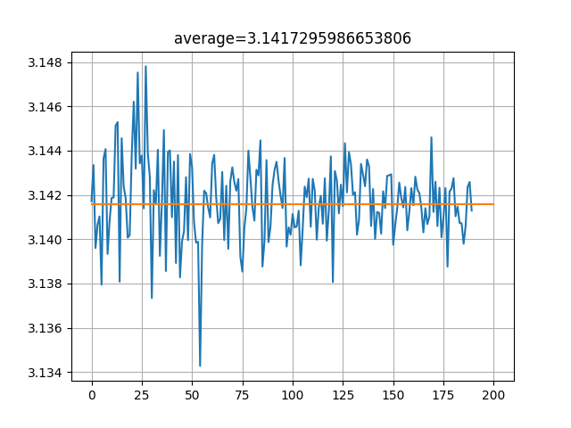

## 9.3 蒙特卡洛方法

### 9.3.1 应用场景一：计算圆周率

#### 用蒙特卡洛方法估算圆周率

图 9.3.1 利用正方形与内切圆估算圆周率

图 9.3.2 随机投点估算圆周率

图 9.3.3 随机点计算圆周率的误差变化

### 9.3.3 应用场景二：计算定积分

图 9.3.4 计算函数积分

#### 用蒙特卡洛方法估算定积分值

图 9.3.5 计算函数积分

### 9.3.3 蒙特卡洛方法

### 9.3.4 实现蒙特卡洛法

### 9.3.5 建立衡量基准

