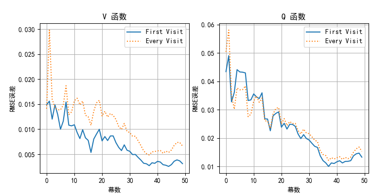

## 9.5 每次访问法蒙特卡洛预测

### 9.5.1 为什么需要预测 $q_\pi$

图 9.5.1 状态价值函数不能决定动作策略

### 9.5.2 每次访问法

### 9.5.3 比较计算 $V_\pi$ 和 $Q_\pi$ 的误差

图 9.5.2 比较计算 $V_\pi$ 和 $Q_\pi$ 的误差

### 9.5.4 比较首次访问法与每次访问法

图 9.5.3 首次访问法与每次访问法的误差比较

